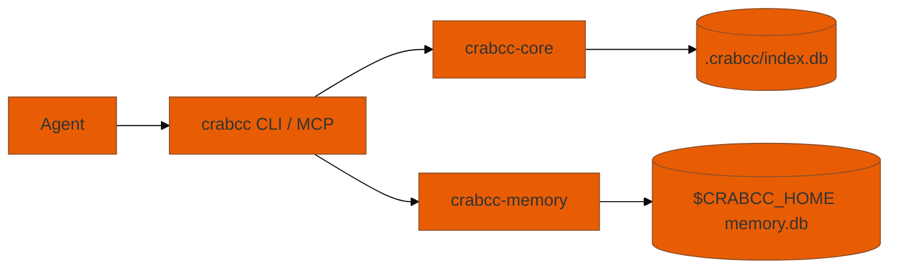

# AGENTS.md

> [agents.md](https://agents.md/) instructions for AI coding agents working in
> this repo. Tool-agnostic: applies to Claude Code, Cursor, Aider, Continue,
> any other LLM-driven editor.

## What this repo is

`crabcc` — a Rust CLI + MCP server that indexes a repo's symbols (functions,
classes, methods, etc.) for symbol-aware lookups. SQLite-backed (`.crabcc/index.db`),
with native fuzzy/prefix search built in-memory from that index (no sidecar),
optional FSST string compression on the signature column (default-on as of
v2.0.0-alpha).

Use it instead of `grep`/`find` for symbol-name queries: `crabcc sym Foo`,
`crabcc refs Foo`, `crabcc callers handleAuth`.

| Doc | Use when |
|-----|----------|
| [`docs/OVERVIEW.md`](docs/OVERVIEW.md) | **Start here** — Mermaid architecture, query router, disk layout |
| [`README.md`](README.md) | Install, usage, bench numbers, ASCII command traces |
| [`crates/crabcc-core/docs/HOW_IT_WORKS.md`](crates/crabcc-core/docs/HOW_IT_WORKS.md) | Schema, extract pipeline, extending languages |

The `crabcc-memory` crate (epic [#2](https://github.com/peterlodri-sec/crabcc/issues/2))
adds a per-repo AI memory layer at `$CRABCC_HOME/repos/<slug>-<hash6>/memory.db`,
fronted by a `Backend` trait, `Palace` facade, and `crabcc memory` CLI / `memory.*` MCP tools.



## Quick orientation

| You want to… | Do this |
|---|---|
| Bootstrap a session in one command | `crabcc go` (index + graph + memory + Claude with `--effort max`) |
| Find a definition | `crabcc sym <Name>` |
| Find references / call sites | `crabcc refs <Name>` / `crabcc callers <Name>` |
| Outline a file | `crabcc outline path/to/file.rb` |
| Which tests cover my edit? | `crabcc affected` (working tree) / `crabcc affected --since <ref>` / `--run` to execute |
| Store / search project memory | `crabcc memory remember <src> <body>` / `crabcc memory search "<query>"` |
| List drawers in this repo | `crabcc memory list --limit 20` |
| Browse memory across all repos (web UI) | `crabcc memory ui` (opens the `/memory` page on `crabcc serve`; needs the `viz` feature) |
| Build & test | `task` (= `cargo build --release && cargo test --workspace`) |
| Lint gate | `task lint` (= `cargo clippy --workspace --all-targets -- -D warnings`) |
| Format | `task fmt` |
| Local CI dry-run | `task ci` |
| Run the FSST bench | `task bench-compress REPO_FIXTURE=/path/to/big-repo` |
| Memory smoke (CLI surface) | `task memory-smoke` |
| Cut a release | `task release VERSION=x.y.z` |
| Bootstrap full dev env | `task setup` (uv + Ollama + model pull + stack up) |
| Run a crabcc agent | `crabcc agent --run "<task>" --backend ollama` |
| Launch Ollama stack | `task ollama-stack-up` (LiteLLM :4000 → Ollama) |
| Wire all agent integrations | `crabcc setup install-integrations --target all --project --yes` |

## Integrations (Cursor, Claude, Gemini, OpenCode, LangChain, OS, kernel)

`crabcc setup install-integrations` installs MCP/skill/hooks fragments for coding
agents, materializes LangChain/LangGraph examples under `~/.crabcc/integrations/langchain/`,
OS templates (launchd/systemd), and prints kernel build recipes. Full guide:
[`install/integrations.md`](install/integrations.md).

| Target | Command |
|--------|---------|
| All | `crabcc setup install-integrations --target all --yes` |
| Cursor + project MCP | `--target cursor --project` |
| Claude Code | `--target claude` (alias: `crabcc install-claude`) |
| LangChain + LangSmith | `--target langchain` then `pip install -e ~/.crabcc/integrations/langchain` |
| OS-native MCP daemon | `--target os` |
| Bleeding-edge kernel | `--target kernel` |

## Ollama agent backend

Default backend is `ollama` (since v2.8). Model: **qwen3.5:35b-a3b-coding-nvfp4**
(Apple Silicon MoE, 3B active/token, 256k context window).

```bash
# One-shot bootstrap (installs uv, Ollama, pulls model, starts stack)
task setup

# Run an agent
crabcc agent --run "trace callers of Store::open" --backend ollama

# Via Claude Code slash command
/crabcc-agent trace callers of Store::open

# Status
crabcc agent-ls --limit 5
task agent-runtime-smoke       # end-to-end smoke test
```

Stack topology (issue #105):
```
Claude Code / crabcc CLI
        ↓
free-claude-code (Anthropic-compat proxy)
        ↓
LiteLLM :4000  (prompt cache, SSE streaming)
        ↓
Caddy :11435   (Bearer-auth gate)
        ↓
Ollama         (qwen3.5:35b-a3b-coding-nvfp4)
```

ENV overrides (all optional):
- `OLLAMA_BASE_URL` — override backend URL (default `http://localhost:4000`)
- `OLLAMA_API_KEY` — LiteLLM master key (read from `~/.crabcc.local.api-key`)
- `CRABCC_OLLAMA_MODEL` — model override
- `OLLAMA_NUM_CTX` — context window (default 262144)

## iTerm2 HUD (issue #132)

Live status-bar showing active agent, token savings, and doctor health.

```bash
task install-iterm2     # copies daemon to AutoLaunch, prints activation steps
task iterm2-test        # run HUD unit tests (no live iTerm2 needed)
crabcc doctor iterm2    # verify daemon is running
```

See `apps/crabcc-iterm2/README.md` for the full guide (RPCs, control sequences,
key bindings, example use-cases).

## Code style

- **Rust 2021 edition**, MSRV pinned via `clippy.toml` (`msrv = "1.86"`, set by `fsst-rs`).
- `rustfmt` defaults — see `rustfmt.toml`. Run `task fmt` before committing.
- `clippy` strict in CI: warnings are errors. Don't `#[allow(...)]` to silence
  them; fix the underlying issue.
- Comments live where the *why* is non-obvious. Don't restate what the code
  does. Don't add docstrings just to satisfy a linter.
- Error handling via `anyhow::Result` at app boundaries; library code in
  `crabcc-core` returns concrete `Result<T, E>` only when the caller needs to
  branch on the error variant.
- New language extractors land in `crates/crabcc-core/src/extract.rs`. Five
  entry points to update: the language enum, the file-extension match, the
  tree-sitter language binding, the per-language symbol-kind table, and the
  fixture under `crates/crabcc-core/tests/fixtures/`. See
  `crates/crabcc-core/docs/HOW_IT_WORKS.md` for the walkthrough.

## Workspace layout

```
crates/
├── crabcc-core/          # Library: indexing, storage, query, FSST codec.
│   ├── benches/symbols.rs    # criterion micro-benches
│   ├── fuzz/                 # cargo-fuzz target for FSST round-trip
│   └── src/
│       ├── compress.rs   # FSST Codec (feature = "compress")
│       ├── store.rs      # SQLite Store + signature_enc decode helper
│       ├── extract.rs    # tree-sitter symbol extractors (TS/JS/RB/Rust/Go/Py)
│       └── …
├── crabcc-cli/           # Binary: `crabcc` (clap) + `crabcc --mcp` shim
├── crabcc-mcp/           # Library: stdio JSON-RPC 2.0 MCP server logic
└── crabcc-memory/        # Library: AI memory layer (M0+); Backend trait,
                          # Palace facade, schema/001_init.sql.

bench/                    # raw-bench.py (vs grep/find), compress-bench.py (FSST gate)
docs/                     # In-tree docs (no longer a submodule). RUST-ANTHOLOGY.md,
                          # PROCESS-SPAWNING.md,
                          # RESEARCH-tts-voice-control-*.md. Per-crate deep-dives live
                          # under crates/*/docs/ (e.g. crabcc-core/docs/HOW_IT_WORKS.md).

schema/001_init.sql                      # Symbol-index schema. Additive only.
crates/crabcc-memory/schema/001_init.sql # Memory schema (wings/rooms/drawers/…).
install/                  # crabcc install-claude templates (hooks-claude.json)
```

## Agent-runs DB

`~/.crabcc/_internal.db` (WAL) is the singleton agent-runs store.
`crabcc agent` writes lifecycle rows; `crabcc agent-ls` / `agent-guard`
/ `agent-kills` read + maintain it. Schema is additive (same rules as
the symbol index — never `DROP COLUMN`).

Bootstrap a fresh machine: `curl -fsSL …/scripts/bootstrap.sh | bash`.


## Conventions agents should respect

- **Don't break the gate.** `crates/crabcc-core/src/compress.rs` and
  `crates/crabcc-core/src/store.rs` are load-bearing for the v2.0.0-alpha
  release. Run `task bench-compress` after changes to either.
- **Schema is additive.** Never `ALTER TABLE … DROP COLUMN`. The pattern is
  add column + idempotent `ALTER` in `Store::open` (see how `signature_enc`
  was landed). Same rule for `crabcc-memory/schema/001_init.sql`.
- **Reuse `crabcc-core` from `crabcc-memory`.** `walker::walk_repo`,
  `hash::sha256_hex`, the `Store::open` PRAGMA pattern, `watch::spawn`, and
  `fts::Fts` are already there — don't reinvent.
- **Tests.** Both feature-on and feature-off must pass for `crabcc-core`
  (`cargo test -p crabcc-core` / `cargo test -p crabcc-core --no-default-features`).
  `crabcc-memory` tests must stay green on `cargo test --workspace`.
- **Don't mass-rewrite imports / spacing on files you barely touched.** The
  linter and `task fmt` keep things consistent — let them do their job.
- **One feature, one PR.** Don't fold release prep, refactors, and a feature
  into a single commit.
- **v4.0 schema change.** Opening a pre-v4 index on v4.0.0+ wipes and
  rebuilds it on the first command (~60 s on this 13k-file repo). The
  banner reads `crabcc: index built with schema v3; wiping and
  re-indexing for symbol-ID edges...` — same shape as the v3.2 upgrade
  banner. There is no migrator, no opt-out flag, and no user choice; the
  rebuild is gated by a `schema_v4_built` meta key. Agents that script
  against `crabcc` should expect the first call after upgrade to take
  rebuild-time, not query-time.

## Memory layer routing

`Palace::open(repo_root)` is idempotent — creates `.crabcc/memory.db` if
missing, reuses if present. Per-git-repo by design.

`PalaceRegistry` caches open palaces by canonical git root. MCP tools accept
an optional `cwd` arg; the server walks up to `.git` via `find_git_root` and
routes the call to the right palace. CLI uses `--root` (defaults to cwd).

`session_id` propagation: pass `$TERM_SESSION_ID` (CLI) or a conversation id
(MCP) to drawer rows so later queries can group by invocation. The
`SqliteBackend::add` path auto-`INSERT OR IGNORE`s the session row so
callers don't need to upsert sessions explicitly.

**Auto-capture** for query-shaped commands (`sym`/`refs`/`callers`/`fuzzy`/
`prefix`) is opt-in via `CRABCC_AUTO_MEMORY=1`. Off by default, zero
overhead. Set the env var to have queries quietly accumulate as drawers.

**Bulk ingest (M2):** `crabcc memory mine project [PATH]` walks a
repository via `crabcc_core::walker::walk_repo` and stores one drawer
per text file under `wing="proj"`. `crabcc memory mine sessions [DIR]`
parses Claude Code JSONL transcripts (defaults to
`$HOME/.claude/projects/`) and stores one drawer per
`(user, assistant)` turn pair under `wing="session"`. Both are
idempotent — the existing `(source_id, sha256)` UNIQUE constraint
on `drawers` makes re-runs return the same id without inserting.

Memory roadmap status (issue #2): M0 (persistent backend) ✅ → M0.5
(`sqlite-vec` ANN, `memory-vec` — **default since v3.0.0-rc.4**) ✅ →
M1a (FTS5 BM25 + RRF hybrid) ✅ → M1b (`fastembed-rs`,
`--features memory-embed`) ✅ → M2
(miners) ✅ → bench gate (`task memory-bench`, ≥ 96.6% R@5 on synthetic
fixture) ✅. The Palace facade lives at `crates/crabcc-memory/src/palace.rs`.

### M3-full roadmap

M3 was "KG ops, tracked separately." Below it is broken into shippable
milestones. The shape draws on
[rohitg00/agentmemory](https://github.com/rohitg00/agentmemory) (Apache-2.0,
surveyed 2026-06-05), a TypeScript memory server that ships these features in
production and reports 95.2% R@5 / 88.2% MRR on the real LongMemEval-S (500
questions). It validated the same core we already run — SQLite, BM25 ⊕ vector,
RRF k=60 — so its lifecycle layer is a credible blueprint, not speculation.
Each milestone respects the additive-schema rule (new columns + idempotent
`ALTER`, never `DROP`).

- **M3a — KG ranker.** Extract entities and relations from drawer bodies into
  an `entities` / `edges` pair (mirrors the symbol-index `edges` table). Add a
  third ranker to `rrf_fuse` (today 2 rankers, `palace/rrf.rs:21`): lexical ⊕
  vector ⊕ graph-entity match. Add session diversification so one session can
  not dominate the top-K. Gate on real LongMemEval, not just the synthetic
  fixture.
- **M3b — Tiered memory.** Promote the existing `wing` column (already
  `proj` / `session`) into the four tiers agentmemory uses: working, episodic
  (session summaries), semantic (extracted facts), procedural (workflows).
  Consolidation rolls raw turns into episodic, then into semantic facts.
- **M3c — Lifecycle.** Ebbinghaus-curve decay scoring (`last_access`,
  `access_count`, `decay_score` columns), auto-eviction below a threshold,
  contradiction detection, and versioning so a corrected fact supersedes the
  stale one instead of competing with it in retrieval.
- **M3d — Capture + privacy.** Grow `CRABCC_AUTO_MEMORY` from one flag into
  hook-driven capture (SessionStart / Stop / PreCompact analogues), and strip
  secrets and `<private>` tags before a drawer is written, never after.

Track each as its own issue under epic #2 when work starts.

## Where things live

- **Issue tracker:** GitHub issues at <https://github.com/peterlodri-sec/crabcc/issues>.
- **In-flight task log:** `.dev-tasks` (gitignored, local-only) tracks
  multi-agent work breakdown for current feature work.
- **Bench fixtures:** mc-mothership at `/Users/peter.lodri/workspace/mc-mothership`
  (NOT inside this repo; never copy or commit it). Pass via `--repo` arg or
  `REPO_FIXTURE` env var.
- **Skills:** `skill/crabcc/SKILL.md` (+ slash command `commands/crabcc-init.md`,
  symlink with `crabcc install-claude`), `skill/stop-slop/SKILL.md` (prose
  hygiene — see "Prose hygiene" below), plus the on-demand audit skills
  (`skill/warp-speed-audit`, `skill/rust-logging-audit`, `skill/crabcc-taskfile`).

## Prose hygiene — stop-slop (all agents)

Every agent working in this repo applies the **stop-slop** skill
([`skill/stop-slop/SKILL.md`](skill/stop-slop/SKILL.md)) to prose it writes —
commit messages, PR descriptions, issue comments, docs, changelog entries.
Drop throat-clearing openers, adverbs, em-dashes, passive voice, binary
"not X, it's Y" contrasts, and vague declaratives; name the actor and state
the point. It is vendored from
<https://github.com/hardikpandya/stop-slop> (MIT — see
[`skill/stop-slop/PROVENANCE.md`](skill/stop-slop/PROVENANCE.md)). It does not
touch code identifiers or quoted output.

## When unsure

Use `crabcc` on this repo to find what you need: `crabcc sym <Name>` for
definitions, `crabcc outline <file>` before reading a large file,
`crabcc callers <Name>` for impact analysis. For symbol-index internals
read `crates/crabcc-core/docs/HOW_IT_WORKS.md`. For memory-layer
specifics read `crates/crabcc-memory/src/palace.rs` and the schema in
`crates/crabcc-memory/schema/`.
