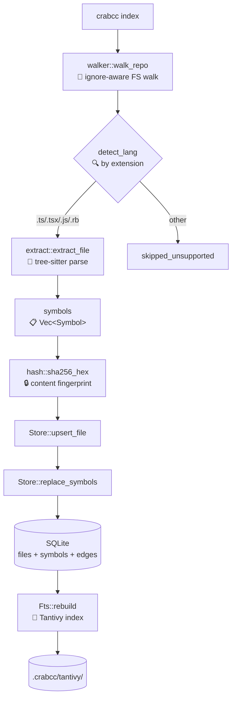
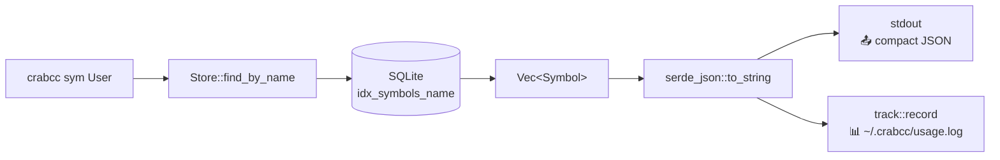
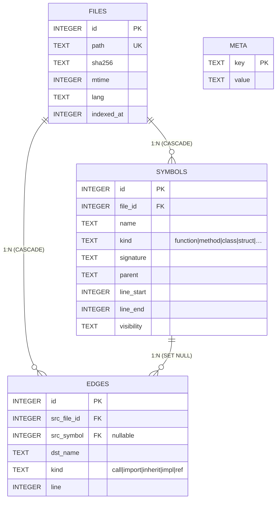
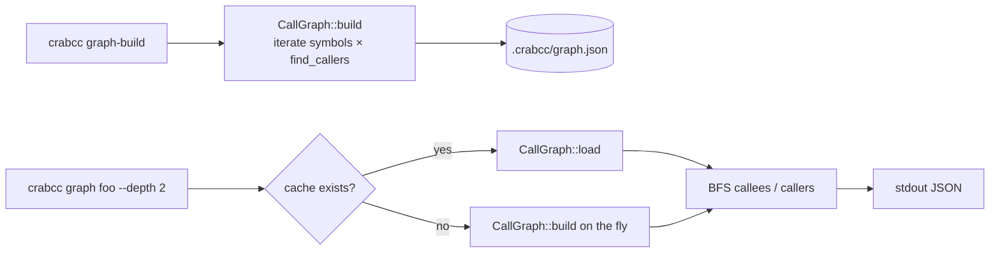
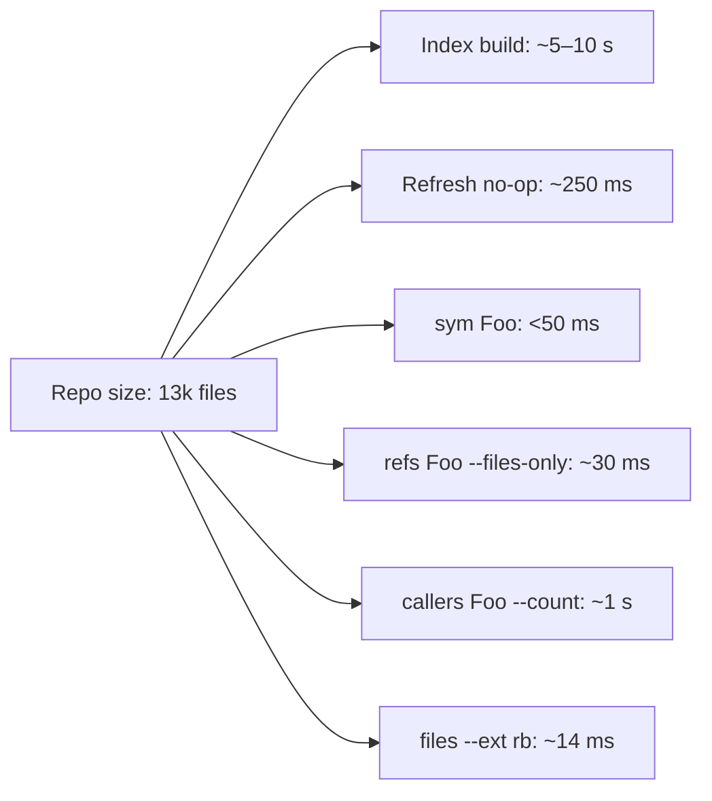

# 🦀 crabcc — architecture

> **Audience**: engineers shipping changes to crabcc.
> **TL;DR**: 3 crates, one SQLite file per repo, one Tantivy sidecar, one optional graph sidecar, one optional FS-watch sidecar. All glued by a JSON-RPC stdio MCP server.

```
🦀  crabcc
├── 🧠  crabcc-core    — extraction, indexing, queries, FTS, graph, watch, telemetry
├── ⚡  crabcc-cli     — clap CLI; one Cmd per subcommand
└── 🔌  crabcc-mcp     — JSON-RPC 2.0 stdio server; thin dispatcher over crabcc-core
```

---

## 1. 🗂️ Crate dependency graph

```mermaid
graph LR
    cli[crabcc-cli<br/>bin] -->|uses| core[crabcc-core<br/>lib]
    cli -->|uses| mcp[crabcc-mcp<br/>lib]
    mcp -->|uses| core
    core -->|extension| sqlite[(SQLite<br/>.crabcc/index.db)]
    core -->|extension| tantivy[(Tantivy<br/>.crabcc/tantivy/)]
    core -->|extension| graph[(graph.json<br/>.crabcc/graph.json)]
    core -->|extension| usage[(usage.log<br/>~/.crabcc/usage.log)]
```

**Every crate compiles in isolation.** `crabcc-core` has zero dependencies on `crabcc-cli` or `crabcc-mcp`; you can use it as a library in any Rust app. The CLI binary is a thin clap-driven dispatcher; the MCP server is a JSON-RPC layer over the same dispatcher logic.

---

## 2. 🔁 The full data flow

What happens when you run `crabcc index` in a repo:



When the user later runs `crabcc sym User`:



When the user runs `crabcc callers find_by --files-only --limit 20`:

```mermaid
flowchart TD
    A[crabcc callers find_by<br/>--files-only --limit 20] --> B[query::query_callers]
    B --> C[Store::list_files]
    C --> D[Loop: per indexed file]
    D --> E{memchr prefilter<br/>🔎 byte-needle scan}
    E -->|miss| D
    E -->|hit| F[ast-grep Pattern::find_all<br/>🌳 name(...) and $RECV.name(...)]
    F --> G{Mode dispatch}
    G -->|FilesOnly| H[Dedupe by file<br/>📁 BTreeSet]
    G -->|Hits| I[Vec&lt;Hit&gt; + early-stop]
    G -->|Count| J[counter += hits.len]
    H --> K{limit reached?}
    K -->|yes| L[break]
    K -->|no| D
    L --> M[Output::Files]
    M --> N[stdout]
```

The early-stop is the perf win — once `--limit 20` is satisfied, we don't walk the rest of the repo's 13k files.

---

## 3. 🧠 Module map (`crabcc-core`)

| Module | Purpose | Lines | Tests |
|---|---|---:|---:|
| `walker.rs` | gitignore-aware FS walk via `ignore` crate | ~95 | 4 |
| `extract.rs` | tree-sitter symbol extraction per language | ~260 | 9 |
| `pattern.rs` | ast-grep `name($$$)` / `$RECV.name($$$)` callers | ~190 | 11 |
| `refs.rs` | tree-sitter identifier-walker for `refs` queries | ~110 | 4 |
| `hash.rs` | SHA-256 wrapper | ~35 | 3 |
| `store.rs` | rusqlite Connection + WAL/foreign_keys/mmap | ~370 | 10 |
| `index.rs` | full + incremental indexing logic | ~410 | 7 |
| `outline.rs` | per-file symbol listing | ~95 | 3 |
| `query.rs` | sym/refs/callers with Mode (Hits/FilesOnly/Count) | ~340 | 13 |
| `fts.rs` | Tantivy fuzzy/prefix sidecar | ~210 | 4 |
| `graph.rs` | call-graph sidecar (.crabcc/graph.json) | ~210 | 5 |
| `watch.rs` | FS-watch worker thread (notify-debouncer-mini) | ~245 | 5 |
| `track.rs` | token-savings telemetry (~/.crabcc/usage.log) | ~280 | 7 |
| `types.rs` | `Symbol`, `Hit`, `Edge`, `SymbolKind` | ~50 | — |
| `lib.rs` | module re-exports | ~15 | — |

**Test count**: 102 (85 core + 17 MCP). 2 ignored (one inherently FS-event-racy watch test, one tempdir-mtime-racy worktree test).

---

## 4. 🗄️ SQLite schema (`schema/001_init.sql`)



### Indexes (the hot paths)

| Index | Covers | Why |
|---|---|---|
| `idx_symbols_name` | `WHERE name = ?` (sym lookup) | `crabcc sym Foo` → microseconds |
| `idx_symbols_file` | `JOIN symbols ON file_id` (outline) | foreign-key joins fast |
| `idx_symbols_file_line` | composite for outline `ORDER BY` | avoid sort |
| `idx_symbols_name_kind` | name + kind filter (future) | pre-filter for kind-narrowed sym |
| `idx_symbols_kind` | kind-only filter | `crabcc files --kind class` (future) |
| `idx_files_lang` | `WHERE lang = ?` (files command) | constant-time `crabcc files --lang ruby` |
| `idx_edges_dst` | `WHERE dst_name = ?` (callers v2) | edge-driven callers query (Track B) |
| `idx_edges_src` | `WHERE src_file_id = ?` | refresh-time edge updates |

### Connection pragmas (set in `Store::open`)

```sql
PRAGMA journal_mode  = WAL;             -- concurrent readers + writer
PRAGMA synchronous   = NORMAL;          -- "fast but durable on power loss"
PRAGMA foreign_keys  = ON;              -- ON DELETE CASCADE fires
PRAGMA mmap_size     = 30000000000;     -- 30 GB cap; SQLite caps to file size
PRAGMA temp_store    = MEMORY;          -- ANALYZE temp tables in RAM
PRAGMA cache_size    = -16000;          -- 16 MB page cache (negative = KiB)
PRAGMA optimize;                        -- run on every open; cheap when stats fresh
```

Plus `busy_timeout = 2000ms` to absorb spurious lock contention during `crabcc watch` refreshes overlapping with reader queries.

---

## 5. 🧵 Threading model — sidecars are real sidecars

crabcc's "sidecars" — graph, watch, fts — run on dedicated threads, not the main thread. The watch sidecar is the most explicit about this:

```mermaid
sequenceDiagram
    participant Main as 🎯 main thread<br/>(crabcc watch)
    participant Worker as 🧵 watch::worker<br/>(named "crabcc-watch")
    participant Notify as 📡 notify thread<br/>(kqueue/inotify)
    participant Store as 🗄️ Arc&lt;Mutex&lt;Store&gt;&gt;

    Main->>Worker: spawn(root, store, debounce)
    Main->>Main: block_until_done()
    Notify-->>Worker: FS event batch
    Worker->>Worker: should_trigger? (filter .crabcc/, ext)
    alt trigger
        Worker->>Store: lock()
        Worker->>Store: index::refresh(root)
        Store-->>Worker: RefreshStats
        Worker-->>Main: println!(stats JSON)
    else skip
        Worker->>Worker: continue
    end
    Main->>Worker: handle.stop() (Ctrl-C)
    Worker-->>Main: Result<()>
```

### Thread-safety of the `Store`

```rust
// crates/crabcc-core/src/store.rs (compile-time assertion)
const _: fn() = || {
    fn assert_send<T: Send>() {}
    assert_send::<Store>();
};
```

`Store: Send` (compile-time enforced). NOT `Sync` — wrap in `Arc<Mutex<Store>>` to share. WAL mode means concurrent reads through *separate* connections don't even need the lock, but the Mutex covers multi-statement transactions inside `index::refresh`.

### Graph sidecar (lazy, no thread)



Build is currently O(symbols × files) — slow on huge repos but correct. Track B of the next sprint moves edges to extraction time, dropping build to O(files).

---

## 6. 🔌 MCP layer (`crabcc-mcp`)

The MCP server is a thin JSON-RPC 2.0 dispatcher over `crabcc-core`. Newline-delimited JSON in, newline-delimited JSON out. EOF on stdin shuts the server down.

```mermaid
sequenceDiagram
    participant Agent as 🤖 LLM agent
    participant Server as 🔌 crabcc --mcp
    participant Core as 🧠 crabcc-core

    Agent->>Server: {"method":"initialize"}
    Server-->>Agent: {protocolVersion, serverInfo, capabilities}
    Agent->>Server: {"method":"tools/list"}
    Server-->>Agent: 9 tool descriptors with JSON schemas
    Agent->>Server: {"method":"tools/call",<br/>"params":{"name":"sym","arguments":{"name":"User"}}}
    Server->>Core: query::find_symbol(&store, "User")
    Core-->>Server: Vec&lt;Symbol&gt;
    Server-->>Agent: {"result":{"content":[{"type":"text","text":"[…]"}]}}
    Agent->>Server: EOF
    Server-->>Agent: (exit 0)
```

### The 9 tools

| Tool | Inputs | Output |
|---|---|---|
| `sym` | `name` | array of Symbol records |
| `refs` | `name`, optional `mode` (hits/files/count), `limit` | hits / files / count |
| `callers` | `name`, optional `mode`, `limit` | hits / files / count |
| `outline` | `file` | array of Symbols ordered by line |
| `files` | optional `under`, `lang`, `ext`, `limit` | array of paths |
| `index` | — | IndexStats |
| `refresh` | — | RefreshStats |
| `fuzzy` | `query` | array of FuzzyHit (Tantivy) |
| `prefix` | `query` | array of FuzzyHit (Tantivy) |
| `graph` | `name`, `dir` (callers/callees), `depth` | array of GraphHit |

All tool results are wrapped in `{ "content": [{ "type": "text", "text": "<JSON>" }] }` — the same JSON the CLI prints. Same code path for both, no double encoding.

---

## 7. 🛠️ How to add a new feature

### Adding a CLI subcommand

1. **Define the variant** in `crates/crabcc-cli/src/main.rs::Cmd`:
   ```rust
   /// What this does, one line.
   Doit { name: String, #[arg(long)] flag: bool },
   ```
2. **Implement** in the `match cli.cmd { … Cmd::Doit { … } => { … } }` arm.
3. **Track** with `crabcc_core::track::record("doit", …)` for telemetry.
4. **Test** in `cargo test --workspace` (integration smoke is enough; unit tests live under `crabcc-core`).
5. **MCP**: add a sibling tool in `crates/crabcc-mcp/src/lib.rs::tools_def()` + dispatch arm.
6. **Docs**: `examples/doit.md` (per-topic) + entry in `examples/README.md` cheatsheet.
7. **Skill**: update `skill/crabcc/SKILL.md` "When to use" table.

### Adding a language

(Detailed in `.tasks` Track C.)

1. Add `tree-sitter-XX` and `ast-grep` lang to workspace deps.
2. `extract::detect_lang` adds the file extensions.
3. `extract::symbol_kind_for(lang, ts_node_kind)` covers the language's relevant node kinds.
4. `pattern::lang_for(lang)` returns the ast-grep `SupportLang`.
5. `refs::is_identifier_kind(lang, ts_node_kind)` covers identifier/constant/property nodes.
6. `tests/fixtures/multi-lang/<XX>/` tiny fixture project.
7. Update `examples/files.md` `--lang` list.

### Adding a sidecar

(Pattern crystallised by `watch.rs` and `graph.rs`.)

1. New module under `crates/crabcc-core/src/`.
2. Persistent state under `.crabcc/<name>/` or `.crabcc/<name>.json`.
3. `Store: Send` lets you wrap in `Arc<Mutex<Store>>` for shared access.
4. If long-running, `pub fn spawn(...) -> Handle` returning a join-able worker.
5. Feedback-loop guard: filter events / writes that originate from `.crabcc/`.
6. Tests: deterministic logic + at most one `#[ignore]`'d e2e if FS-event-racy.
7. CLI subcommand wraps the spawn / query.
8. MCP tool wraps the query side (rarely the spawn side — long-running tools don't fit MCP's request/response shape).

---

## 8. 🚀 Build profiles & optimization

```toml
# Cargo.toml
[profile.release]            # default for `cargo build --release`
opt-level     = 3
lto           = "fat"        # whole-program; +30s compile, ~5–10% runtime
codegen-units = 1
panic         = "abort"      # smaller binary, no unwinding tables
strip         = true
debug         = false

[profile.dev-fast]           # `cargo build --profile dev-fast`
inherits      = "dev"
opt-level     = 1            # ~half the time, runtime ~2–3× faster than -O0
debug         = 1            # minimal debug info; faster linker

[profile.test]
opt-level     = 1            # tree-sitter-heavy tests need optimisation
```

UPX compression in CI release shaves another ~50–70% off the binary size. macOS aarch64 is exempt (UPX doesn't pack it).

---

## 9. 📈 Performance shape

Numbers from `bench/results/REPORT.md` on `mc-mothership` (~13k indexed files):



vs `grep -rn` on the same repo: 47–4400× speedup; vs `ripgrep`: 5–100× on whole-repo questions.

---

## 10. 🗺️ Roadmap visual

```mermaid
gantt
    title crabcc roadmap
    dateFormat YYYY-MM-DD
    section v1.0
    Token-shaping flags          :done, 2026-04-29, 1d
    Watch + Graph sidecars       :done, 2026-04-30, 1d
    SQLite tuning                :done, 2026-04-30, 1d
    CI + nextest + JUnit         :done, 2026-04-30, 1d
    section v1.x
    Dead-code clippy strict      :active, 2026-04-30, 2d
    ARCHITECTURE.md              :active, 2026-04-30, 1d
    section v2.0
    crabcc memory MVP (MemPalace port)    : 2026-05-05, 14d
    Edges-at-extract + faster graph       : 2026-05-05, 7d
    Languages: Go, Python, Rust           : 2026-05-05, 9d
    FSST string compression               : 2026-05-12, 5d
    install.sh + brew tap                 : 2026-05-15, 2d
```

Issue tracker: <https://github.com/peterlodri-sec/crabcc/issues>

---

## 11. 🔗 References

- **Source-of-truth docs**: `docs/RESEARCH-mempalace.md` (1027 lines) for the v2.0 memory port; `docs/RESEARCH-fsst.md` (272 lines) for the v2.0 compression layer.
- **Sprint plan**: external `task-items/crabcc/.tasks` (4-dev × 2-week sprint).
- **API examples**: `examples/{indexing,sym,refs,callers,outline,files,fuzzy-prefix,jq-pipelines,track,mcp-setup,wire-protocol}.md` and the `CLI.md` / `MCP.md` cheatsheets.
- **Manpage**: `man/crabcc.1` — `man ./man/crabcc.1` to render.
- **Bench**: `bench/results/REPORT.md` + `bench/raw-bench.py` + `bench/visualize.py`.

---

## 12. 🆘 Where to look when something breaks

| Symptom | First file to read | Likely cause |
|---|---|---|
| `crabcc index` skips files I expect | `walker.rs`, `.gitignore` | gitignore rule, hidden file, unsupported extension |
| `crabcc sym Foo` returns `[]` for a known symbol | `extract.rs::symbol_kind_for` | language node-kind mapping missing |
| `crabcc callers Foo` returns 0 hits but Foo is called | `pattern.rs::find_callers` | ast-grep pattern doesn't match the language's call syntax |
| `crabcc watch` doesn't pick up changes | `watch.rs::should_trigger` | feedback-loop guard / extension filter / FS event timing |
| Tests pass locally, fail in CI | `.github/workflows/ci.yml` | env mismatch, missing release-mode build, fmt drift |
| Slow `find_by_name` | `Store::open` PRAGMAs, `idx_symbols_name` | missing index, ANALYZE not run |
| `crabcc graph foo` is slow | `graph.rs::build` | O(symbols × files); plan = move to edges table (Track B) |
| MCP tool not found | `crabcc-mcp/src/lib.rs::tools_def` + `dispatch_tool` | tool added in only one of the two places |

---

## 13. 🏁 Footer

This doc is a living document. Keep it accurate by updating each section when you add a sidecar, change a pragma, or alter the schema. The mermaid diagrams render natively on GitHub; if you add a new diagram, prefer mermaid over hand-drawn ASCII unless mermaid can't express it.

If you're reading this for the first time, the path of least surprise is:

1. Read `README.md` for the user-facing pitch.
2. Read `examples/CLI.md` for what the tool does.
3. Read this file for how it does it.
4. Read `docs/RESEARCH-mempalace.md` and `docs/RESEARCH-fsst.md` for where it's going.

Welcome aboard. 🦀
