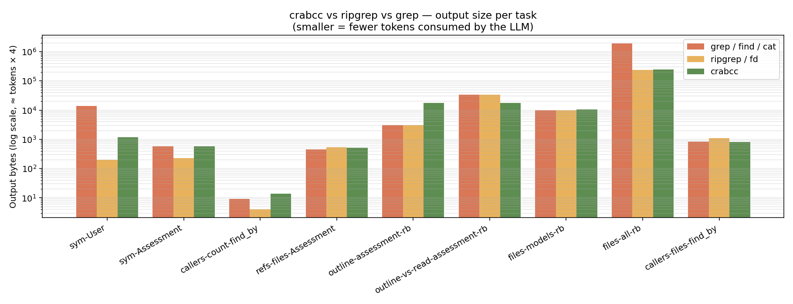
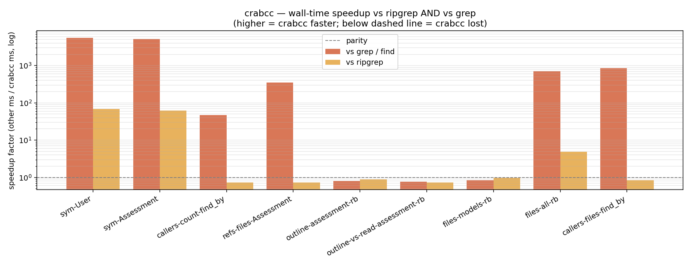

<h1 align="center">
  <br/>
  crabcc
</h1>

<p align="center">
  <em>Symbol index for AI coding agents.</em><br/>
  <strong>up to 4412× faster than <code>grep -rn</code></strong> on monorepos &nbsp;·&nbsp;
  <strong>up to 55× faster than ripgrep</strong> on whole-repo lookups &nbsp;·&nbsp;
  <strong>85% fewer bytes</strong> sent to the LLM
</p>

> **🔒 Repository moved 2026-05-28.** crabcc is now hosted at
> [`crabcc-labs/crabcc`](https://github.com/crabcc-labs/crabcc) (**private
> repository**). Previously at `peterlodri-sec/crabcc`. Existing references
> — bookmarks, CI configs, `cargo install --git` URLs, `gh api` calls —
> should update to the new URL. Access is invite-only.

<p align="center">
  <a href="https://github.com/crabcc-labs/crabcc/actions/workflows/ci.yml">
    
  </a>
  <a href="https://github.com/crabcc-labs/crabcc/actions/workflows/index-publish.yml">
    
  </a>
  <a href="https://github.com/crabcc-labs/crabcc/releases/latest">
    
  </a>
  <a href="https://github.com/crabcc-labs/crabcc/issues">
    
  </a>
  
  
</p>

<p align="center">
  <strong>📊 <a href="./docs/OVERVIEW.md">Visual overview</a></strong> — colorful architecture diagrams (Mermaid)<br/>
  <sub>Regenerate in Claude Code: <code>/crabcc-generate-overview</code></sub>
</p>

---

## Install

### One-line (canonical)

```bash
gh api -H 'Accept: application/vnd.github.v3.raw' /repos/crabcc-labs/crabcc/contents/install.sh | bash
```

(Or, without `gh`: `curl -fsSL https://raw.githubusercontent.com/crabcc-labs/crabcc/main/install.sh | bash`.)

The installer:

- Prompts for `gh auth login` if you aren't authenticated yet (private-repo aware).
- Builds `crabcc` from source via `cargo install --locked`.
- Writes shell completions for your current shell (zsh / bash / fish).
- Links the Claude Code skill + slash commands into `~/.claude/` when the
  `claude` CLI is present.
- Prints a `crabcc go` hint so the next thing you do is the right thing.

> **Heads-up:** the one-liner builds in a tempdir, so it can only do a
> minimal Claude integration (skill + slash-command symlinks). For the
> full surface — [RTK (Token Killer)](https://crates.io/crates/rtk)
> detection + install, hook templates, MCP registration hint — clone
> crabcc to a stable location and run `crabcc install-claude` from
> inside that clone. `scripts/bootstrap.sh` (below) handles all of
> this automatically. Full script consolidation tracked in
> [#501](https://github.com/peterlodri-sec/crabcc/issues/501).

Knobs (env or `--flag`):

| flag | env | default | what |
|---|---|---|---|
| `--bin-dir=DIR` | `CRABCC_INSTALL_DIR` | `~/.cargo/bin` | install target |
| `--version=TAG` | — | main HEAD | install a specific release |
| `--no-completions` | — | off | skip shell completions |
| `--no-claude` | — | off | skip ~/.claude/ symlinks |

### Fresh machine — `scripts/bootstrap.sh`

For a brand-new dev box, `bootstrap.sh` is the bigger sibling of `install.sh`:
it preflights `rustup`, clones into `~/workspace/bin/crabcc`, builds,
ad-hoc-codesigns the binaries (Sequoia provenance fix), wires shell aliases,
**runs `crabcc install-claude --yes`** (skill + commands + RTK detection),
and optionally brings up Docker/Ollama and the macOS LaunchAgent.
Idempotent — same script for fresh install **and** upgrade.

```bash
curl -fsSL https://raw.githubusercontent.com/peterlodri-sec/crabcc/main/scripts/bootstrap.sh | bash

# Defaults:
#   ✓ Docker Desktop + Ollama stack (LiteLLM proxy on :4000)
#   ✓ Claude Code skill / commands / RTK detection (via crabcc install-claude)
#   ✓ Shell aliases (zsh + bash)
#
# Opt-outs:
#   --no-docker       skip Docker + Ollama stack (binary + Claude only)
#   --no-aliases      skip shell alias install
#   --cli-only        binaries only — skip Claude / aliases / Docker
#   --check-only      preflight only; no writes
#
# Opt-ins:
#   --with-launchd    register the macOS LaunchAgent (background re-index)
#   --with-macos-app  build + open the .dmg
```

### From source

```bash
cargo install --path crates/crabcc-cli
```

### Agent integrations (Cursor, Claude, Gemini, OpenCode, LangChain, OS, kernel)

```bash
crabcc setup install-integrations --target all --project --yes
# or: task install-integrations TARGET=cursor,langchain PROJECT=1
```

See [`install/integrations.md`](./install/integrations.md) for per-target MCP fragments,
LangGraph tools, launchd/systemd units, and optional bleeding-edge kernel builds.

### Claude Code integration

```bash
crabcc install-claude          # symlinks skill + commands; offers to install RTK
```

The `install-claude` subcommand:

- Symlinks the skill + slash-commands into `~/.claude/`.
- Detects [RTK (Token Killer)](https://crates.io/crates/rtk) on PATH and
  offers to `cargo install rtk` if missing — RTK is a hook-based
  shell-output token proxy that pairs with the Bash hook below.
- Prints the `claude mcp add crabcc -- crabcc --mcp` invocation and the hook
  templates (SessionStart auto-refresh, PreToolUse grep→crabcc hint,
  PreToolUse Read/Bash session-cache hooks) for you to paste into
  `~/.claude/settings.json`. It does **not** modify any global Claude
  config files.

Hook templates: [`install/hooks-claude.json`](./install/hooks-claude.json).
Pass `--yes` to skip per-symlink prompts, or `--print-hooks` to dump only the
hook JSON (`crabcc install-claude --print-hooks > hooks.json`).

Then in Claude Code: `/reload-plugins`.

### macOS `.app` + DMG (optional)

If you want a real `Crabcc.app` you can drag into `/Applications` and grant
**App Management** privacy permission (System Settings → Privacy & Security →
App Management):

```bash
task dmg                       # produces dist/crabcc-<version>.dmg
open dist/crabcc-*.dmg         # mount + drag Crabcc.app to /Applications
```

The bundle is ad-hoc codesigned (`com.crabcc.installer`), runs as a menubar
app (`LSUIElement`), exposes Taskfile entries as a clickable **Run Task**
submenu, and registers a `com.crabcc.agentd` LaunchAgent that survives
sleep/wake/restart and refreshes the index every 5 minutes for any repo
listed in `~/.crabcc/agent/repos.list`.

Uninstall the LaunchAgent without removing the app:

```bash
scripts/install-macos-helpers.sh --remove
```

### Index your repo

```bash
cd <your-repo>
crabcc index            # one-time, ~5–30s on a 13k-file repo
crabcc refresh          # incremental, ~250ms no-op (mtime + sha256 keyed)
crabcc watch            # auto-refresh on file changes (Ctrl-C to exit)

# Or in one step — index + graph + memory + open a Claude session:
crabcc go
```

The symbol index lives at `<repo>/.crabcc/index.db`; add `.crabcc/` to
`.gitignore`. The AI memory store lives at
`$CRABCC_HOME/repos/<slug>-<hash6>/memory.db` (default `$CRABCC_HOME =
~/.crabcc`), so worktrees of the same repo share one memory.db and
`git clean -fdx` doesn't blow it away.

## Ollama agent backend

`crabcc agent --run` routes through a local LiteLLM proxy to
**qwen3.5:35b-a3b-coding-nvfp4** (Apple Silicon MoE, 3B active/token, 256k context).

```bash
# Bootstrap everything (uv, Ollama, model pull, LiteLLM stack)
task setup

# Run an agent
crabcc agent --run "trace callers of Store::open" --backend ollama

# Stack management
task ollama-stack-up       # Apple Containers → Docker, starts LiteLLM :4000
task ollama-stack-down
task agent-runtime-smoke   # end-to-end smoke test
```

## iTerm2 integration

Live status-bar HUD, key-bound RPCs, and control sequences (issue #132).

```bash
task install-iterm2        # copies daemon → AutoLaunch, prints activation
crabcc doctor iterm2       # verify
```

Status bar: `🦀 warp-speed-audit · 4m12s | saved 1.2M tok | 🟢`

See [apps/crabcc-iterm2/README.md](apps/crabcc-iterm2/README.md) for setup guide,
key binding recommendations, and example use-cases.

---

A small Rust CLI + MCP server that indexes your repo's symbols (functions, classes,
methods, etc.) into a SQLite store and exposes them via four primitives an agent
actually wants: `sym`, `refs`, `callers`, `outline`. Plus token-shaping flags
(`--count`, `--files-only`, `--limit`) that collapse 16k-token result sets to ~3
tokens when the question only needs a number or a deduped file list.

Languages today: TypeScript, TSX, JavaScript, Ruby, Rust, Go, Python. Adding a language
is a tree-sitter grammar plus an extractor.

<p align="center">
  
</p>

```text
$ crabcc sym Assessment
[{"name":"Assessment","kind":"class","signature":"class Assessment < ApplicationRecord",
  "file":"app/models/assessment.rb","line_start":1,"line_end":991, ... }]

$ crabcc callers find_by --count
{"count":475}

$ crabcc refs Assessment --files-only --limit 10
{"files":["app/builders/.../part_builder.rb", ...]}      ← 253 bytes vs 62,541
                                                          (–99.6%)
```

## Table of contents

- [**Visual overview** (diagrams)](./docs/OVERVIEW.md)
- [Why](#why)
- [Install](#install)
  - [Claude Code integration](#claude-code-integration)
- [Usage](#usage)
  - [AI memory (`crabcc memory`, M0–M2 + bench gate)](#ai-memory-crabcc-memory-m0m2--bench-gate)
- [Token-shaping flags](#token-shaping-flags)
- [Bench results](#bench-results-mc-mothership-13k-indexed-files)
- [Architecture](#architecture)
- [When NOT to use crabcc](#when-not-to-use-crabcc)
- [Status & roadmap](#status)
- [Contributing](#contributing)

Deep dives: [**`docs/OVERVIEW.md`**](./docs/OVERVIEW.md) (diagrams) · [`crates/crabcc-core/docs/HOW_IT_WORKS.md`](./crates/crabcc-core/docs/HOW_IT_WORKS.md) · [`docs/RUST-ANTHOLOGY.md`](./docs/RUST-ANTHOLOGY.md) · [`examples/`](./examples/) · [`man/crabcc.1`](./man/crabcc.1)

---

## Why

`grep -rn` and `find . -name` are the wrong defaults for an LLM. They walk
`node_modules/`, `.git/`, `tmp/`. They emit unstructured text the agent has to
re-parse. They don't understand "symbol" — `class User` and the string `"User"` look
the same to grep. And on a real monorepo (~13k files), they routinely **time out at
60 seconds**.

`rg`/`fd` fix the gitignore part but still rescan from disk on every query. crabcc
reads from a SQLite index — the answer is already in memory. Plus the output is
typed: `{name, kind, signature, parent, file, line_start, line_end}`, not a wall of
text.

---

## Usage

| Question                             | Command                                              |
|--------------------------------------|------------------------------------------------------|
| Where is `Foo` defined?              | `crabcc sym Foo`                                     |
| What calls `handleAuth`?             | `crabcc callers handleAuth`                          |
| **How many** call sites of `find_by`?| `crabcc callers find_by --count`                     |
| **Which files** reference `UserId`?  | `crabcc refs UserId --files-only --limit 20`         |
| All references to `UserId`           | `crabcc refs UserId`                                 |
| What's in this file?                 | `crabcc outline path/to/file.rb`                     |
| List `.rb` files under `app/models`  | `crabcc files --under app/models --ext rb`           |
| Misremembered name?                  | `crabcc fuzzy Asseessment`  (Levenshtein dist 2)     |
| Names starting with…                 | `crabcc prefix getUser`                              |
| How many tokens have I saved?        | `crabcc track`                                       |
| Store a free-form note for this repo | `crabcc memory remember "doc:1" "<body>"`            |
| Search past notes                    | `crabcc memory search "<query>"`                     |
| List drawers in this repo            | `crabcc memory list --limit 20`                      |
| **Bulk-ingest** the repo as drawers  | `crabcc memory mine project`                         |
| **Bulk-ingest** Claude Code sessions | `crabcc memory mine sessions`                        |

Full examples: [`examples/CLI.md`](./examples/CLI.md). MCP wire-level walkthrough:
[`examples/MCP.md`](./examples/MCP.md).

### AI memory (`crabcc memory`, M0–M2 + bench gate)

Local-first, per-repo memory at `$CRABCC_HOME/repos/<slug>-<hash6>/memory.db`
(default `$CRABCC_HOME = ~/.crabcc`). Per-repo by design: the slug is the
repo's basename and `<hash6>` is the first 6 hex chars of
`sha256(remote.origin.url)` so worktrees of the same repo share one db
([#484](https://github.com/peterlodri-sec/crabcc/pull/484)). Ships the
full pipeline tracked by [issue #2](../../issues/2):

- **Storage** — `SqliteBackend` with WAL + FSST drawer-body compression
  (issue #14), plus `sqlite-vec` ANN scaffold behind `--features
  memory-vec` (issue #17).
- **Hybrid search** — FTS5 BM25 + cosine KNN fused via Reciprocal Rank
  Fusion (k = 60). `crabcc memory search QUERY [--mode lexical|vector|hybrid]`.
- **Real embeddings** — `FastEmbedder` (MiniLM-L6-v2, 384-dim) behind
  `--features memory-embed` (issue #18). With it on, `Palace::search`
  defaults to `Hybrid`; with it off, `Lexical`.
- **Miners (M2)** — `crabcc memory mine project [PATH]` walks a repo
  and stores one drawer per text file; `crabcc memory mine sessions [DIR]`
  parses Claude Code JSONL transcripts and stores one drawer per
  `(user, assistant)` turn pair. Both idempotent on re-run via the
  existing `(source_id, sha256)` UNIQUE constraint.
- **CLI/MCP surface** — 10 CLI subcommands and 10 matching `memory.*`
  MCP tools. Each MCP tool accepts an optional `cwd` arg — the server
  walks up to `.git` and routes calls to the right per-project palace.
- **Bench gate** — [`bench/memory`](./bench/memory) ships a
  LongMemEval R@k harness; the bundled synthetic fixture clears
  R@5 ≥ 96.6% under both `lexical` and `hybrid` modes. Run it via
  `task memory-bench` (or point at the real LongMemEval JSON via
  `task memory-bench DATASET=path/to/longmemeval_oracle.json`).

End-to-end walkthrough: [`examples/memory.md`](./examples/memory.md).
Demo GIF: [`assets/demo-memory.gif`](./assets/demo-memory.gif).

**Auto-capture:** set `CRABCC_AUTO_MEMORY=1` to have `sym` / `refs` /
`callers` / `fuzzy` / `prefix` quietly store a drawer summarising each
query. Off by default (zero overhead).

```bash
CRABCC_AUTO_MEMORY=1 TERM_SESSION_ID="$TERM_SESSION_ID" crabcc sym MyType
crabcc memory list --limit 5    # see what got captured
```

---

## Token-shaping flags

`refs` and `callers` accept three mutually-exclusive output shapes:

```bash
crabcc refs Assessment                       # 62,541 bytes — full hits
crabcc refs Assessment --files-only --limit 5    # 253 bytes  (–99.6%)
crabcc refs Assessment --count                   # 14 bytes   (–99.98%)
```

Pick the smallest shape the question allows. The early-stop on `--limit` makes the
small-shape calls cheaper at the CLI layer too — not just smaller payload, fewer
files walked.

Pair with `jq` for projection:

```bash
crabcc outline foo.rb | jq -r '.[] | [.name, .line_start] | @tsv'
crabcc callers find_by | jq 'group_by(.file) | map({file: .[0].file, n: length})'
```

---

## Bench results (mc-mothership, ~13k indexed files)

CLI-vs-CLI, no Claude session involved. Measures only the bytes the LLM's stdout
buffer would receive and wall-time.

<p align="center">
  
</p>
<p align="center">
  
</p>

| Task                              | crabcc B | grep B  | crabcc  | grep    | speedup    |
|-----------------------------------|---------:|--------:|--------:|--------:|-----------:|
| `sym User`                        | 1.2k     | TIMEOUT | 13.8ms  | 60.0s ⚠ | **4348×**  |
| `sym Assessment`                  | 584      | TIMEOUT | 13.6ms  | 60.0s ⚠ | **4412×**  |
| `callers --count find_by`         | 14       | 9       | 13.8ms  | 52.7s   | 3820×      |
| `refs --files-only Assessment`    | 513      | 460     | 31.5ms  | 13.4s   | 424×       |
| `files --ext rb` (whole repo)     | 244k     | 1.9M    | 15.7ms  | 9.6s    | 614×       |
| `callers --files-only find_by`    | 1.0k     | 831     | 13.9ms  | 48.0s   | **3451×**  |

Aggregate: **85% fewer bytes** (≈ 411k input tokens saved per batch, ≈ \$1.23),
**1736× faster aggregate wall-time**.

Honest losses: single-file outline of a small file (where `grep -nE` is already
trivial) and small directory listings. crabcc returns rich JSON, raw `grep` returns
just the matching lines — when the question is small, raw wins on bytes.

### v2.10.x perf passes (issue [#112](https://github.com/peterlodri-sec/crabcc/issues/112))

| Lever                                            | Where it lives | Measured Δ on hot paths |
|--------------------------------------------------|----------------|------------------------:|
| `lto=fat` + `codegen-units=1` + `panic=abort`    | `Cargo.toml` `[profile.release]` | (baseline — landed pre-2.10) |
| `cache_size = -64 MiB` (was -16 MiB)             | `Store::open` PRAGMAs | ~30% on bulk writes, faster cold reads on warm I/O |
| `release-native` profile + `target-cpu=native`   | `Cargo.toml` + `task build-native` | +5–15% on byte-scan / index loops; SIGILL on non-matching CPU |
| `tikv-jemallocator` global allocator             | `crabcc-cli/src/main.rs` | ~5–12% on alloc-heavy paths (extract.rs, MCP `serve_io`) |
| `bumpalo` per-file arena during tree-sitter walk | `crabcc-core/src/extract.rs` | already shipped; ~80% of the gain a nightly `Vec<T, A>` would offer |
| Auto-snapshot of `.crabcc/` after index/refresh  | `crabcc-cli/src/backup.rs` | bookkeeping only — best-effort, never blocks the index path |

The native build is **local-only** — never ship the resulting binary. The
published release binary stays portable.

Deferred (still on #112): SIMD intrinsics in `extract.rs`'s tokenizer (need
`cargo flamegraph` data first), PGO via `cargo-pgo` (`task pgo-release`).

Full report (with ripgrep comparison): [`bench/results/REPORT.md`](./bench/results/REPORT.md).
Re-run:

```bash
cd bench && python3 raw-bench.py /path/to/your/repo && python3 visualize.py
```

---

## Internal agents (per-crate specialists)

`crabcc agent --profile internal/<name>` loads a per-crate agent profile
from `internal_agents/`. Each profile pairs a TOML config (model,
max-iterations, env, gate commands) with a Markdown system prompt that
specialises an agent for one crate. Five profiles ship today:

| Profile | Owns | Bench gates |
|---|---|---|
| `internal/crabcc-core`   | indexing + storage + query primitives | `task bench-compress`, `task bench` |
| `internal/crabcc-cli`    | clap surface + agent runtime + manager | — |
| `internal/crabcc-mcp`    | stdio MCP server + tool surface | `cargo bench -p crabcc-mcp` |
| `internal/crabcc-memory` | AI memory layer + miners + embedders | `task memory-bench` |
| `internal/crabcc-viz`    | localhost dashboard + sync HTTP | — |

Each profile pulls in `internal_agents/shared.agent.md` as a preamble
(rebase-first workflow, lint/test/PR contract, manager coordination).
Missing profiles error hard with the available list — typos never
silently fall through to "no profile". Profile env (default
`CRABCC_BUILD_PROFILE=release-native`) is exported to the spawned
agent's child process.

```bash
# Drive a single crate-specialist on the host:
crabcc agent --profile internal/crabcc-core --run "audit hot loops in extract.rs"

# Per-crate repomix bundle (much smaller than full repo) for the agent:
task repomix-crate CRATE=crabcc-core
```

### Running all five in parallel via Apple `container`

[Apple's `container`](https://github.com/apple/container) is a Mac-native
OCI runtime backed by Virtualization.framework — drop-in for Docker on
arm64. The bundled `install/internal-agents/{Containerfile,compose.yml}`
work with both.

```bash
# 1. Install Apple container (one-time, macOS 15+):
brew install apple/container/container          # Homebrew tap
# Or from the official release: https://github.com/apple/container/releases

# 2. Build the image (uses the BuildKit-style Containerfile):
container build -t crabcc-internal-agents:dev \
    -f install/internal-agents/Containerfile .

# 3. Bring up all five per-crate agents:
container compose -f install/internal-agents/compose.yml up

# 4. Stream one agent's logs:
container compose -f install/internal-agents/compose.yml logs -f crabcc-core

# 5. Bash into a running agent:
container exec -it crabcc-agent-core bash

# 6. Tear down:
container compose -f install/internal-agents/compose.yml down
```

Same compose file works under Docker / Podman without changes — every
service entry is OCI-compatible, no Apple-specific keys.

### Verifying agents work inside the container

The `Containerfile` bakes in `cargo`, `task`, `gh`, `repomix`, plus a
`CARGO_HOME=/cargo` named volume so agents share dep compiles
(~5× faster on a warm cache). Quick smoke:

```bash
container run --rm \
    -v "$PWD":/workspace \
    -e CRABCC_PROFILE=internal/crabcc-core \
    crabcc-internal-agents:dev \
    "noop"           # runs `crabcc agent --profile internal/crabcc-core --run noop`
```

A successful run prints `crabcc agent: id=<hex>` and writes a row to
`~/.crabcc/_internal.db` (host-visible because the repo is bind-mounted).

#### Useful run-time flags

Apple `container`'s VMs run with a default 1 GiB / 4 CPU envelope and a
locked-down capability set; for resource-intensive agent work you can
override per-invocation. The bundled `compose.yml` already sets
`mem_limit: 4g` + `cpus: 4` + `cap_drop: ALL` + the SSH-agent passthrough
on every service; the table below is the equivalent for ad-hoc
`container run`:

| Flag | What it does |
|---|---|
| `--memory 32g --cpus 8` | Override the per-VM ceiling (default 1 GiB / 4 CPU). For repo-wide refactors against the memory crate's bench harness. |
| `--init` | Runs the lightweight init as PID 1 — forwards signals + reaps zombies. Always pass this for agents that spawn cargo/rustc/gh. |
| `--ssh` | Mounts `${SSH_AUTH_SOCK}` at `/run/host-services/ssh-auth.sock`. Survives logout/login — `git clone git@github.com:...` Just Works. |
| `--volume $PWD:/workspace` | Repo root bind-mount. RW; backup loop reads from here. |
| `--cap-drop ALL --cap-add CHOWN --cap-add DAC_OVERRIDE` | Minimum-viable cap set for agent edits. Compose has these. |
| `--publish 127.0.0.1:7878:7878` | Forward the live dashboard port if you `crabcc serve` inside the agent VM. |
| `--rm` | Don't accumulate stopped containers. Always pass for short-lived agents. |

Resource-heavy build of the image itself? Bump the builder VM:

```bash
container builder stop && container builder delete
container builder start --cpus 8 --memory 16g
container build -t crabcc-internal-agents:dev -f install/internal-agents/Containerfile .
```

#### Resource snapshot

```bash
container stats                              # all running, top-style
container stats crabcc-agent-core            # one specific
container stats --no-stream --format json    # one-shot JSON for scripting
```

#### Logs

```bash
container compose -f install/internal-agents/compose.yml logs -f crabcc-core
container logs crabcc-agent-core              # alt ad-hoc form
container logs --boot crabcc-agent-core       # VM boot + init dmesg (debugging)
```

#### Inspect

```bash
container ls --format json --all | jq
container inspect crabcc-agent-core | jq
container image inspect crabcc-internal-agents:dev | jq
```

## Architecture

> **Prefer diagrams?** See [`docs/OVERVIEW.md`](./docs/OVERVIEW.md) for the full Mermaid map (indexing, query router, memory RRF, integrations). This section keeps ASCII traces for copy-paste debugging.

```
crates/crabcc-core/   ← extraction, indexing, queries, FTS, tracking
crates/crabcc-cli/    ← clap CLI; Cmd dispatcher
crates/crabcc-mcp/    ← stdio JSON-RPC 2.0 MCP server
crates/crabcc-memory/ ← Palace facade, Backend + Embedder traits, hybrid search
crates/crabcc-viz/    ← localhost call-graph dashboard (issue #64)
schema/001_init.sql   ← SQLite schema (files, symbols, edges)
internal_agents/      ← per-crate agent profiles + system prompts (Ask B)
installer/Crabcc.app/ ← macOS .app bundle (issue #107)
skill/crabcc/         ← Claude Code skill (auto-routing rules)
commands/             ← Claude Code slash commands
bench/                ← raw-CLI A/B benchmark harness + visualize
```

### The layers

```
                         ┌───────────────────────────┐
  $ crabcc sym Foo       │ crabcc-cli                │  clap dispatch · sonic-rs
  $ crabcc memory search │   src/main.rs             │  JSON encode · stdout
                         │   src/memory.rs           │
                         └─────────────┬─────────────┘
                                       │
                ┌──────────────────────┼──────────────────────┐
                ▼                      ▼                      ▼
    ┌────────────────────┐ ┌────────────────────┐ ┌────────────────────┐
    │ crabcc-core        │ │ crabcc-memory      │ │ crabcc-mcp         │
    │  walker · extract  │ │  Palace · Backend  │ │  JSON-RPC stdio    │
    │  store · graph     │ │  Embedder · RRF    │ │  tool dispatch     │
    │  track · fts · fsst│ │  PalaceRegistry    │ │  OpenAPI 3.1 spec  │
    └─────────┬──────────┘ └──────────┬─────────┘ └─────────┬──────────┘
              │                       │                     │
              └───────────────────────┼─────────────────────┘
                                      ▼
                       ┌──────────────────────────────┐
                       │ Per-repo state                │
                       │  <repo>/.crabcc/              │
                       │    index.db (FTS5 + symbols)  │
                       │    tantivy/ (fuzzy + prefix)  │
                       │    graph.json (call graph)    │
                       │    fsst.symbols (codec)       │
                       │  $CRABCC_HOME/repos/<slug>/   │
                       │    memory.db (drawers + vec)  │
                       └──────────────────────────────┘
```

The CLI is a thin dispatcher: clap parses, the matched arm calls into one of three library crates, and `sonic_rs::to_string` encodes the result. The library crates are independent — `crabcc-mcp` runs the same code paths as the CLI but over JSON-RPC 2.0 instead of argv. `crabcc-memory` is the only crate that touches `memory.db`; symbol-index state (`index.db`, `tantivy/`, `graph.json`, `fsst.symbols`) stays in the repo's `.crabcc/`. Memory was relocated from `<repo>/.crabcc/memory.db` to `$CRABCC_HOME/repos/<slug>-<hash6>/memory.db` in [#484](https://github.com/peterlodri-sec/crabcc/pull/484) so worktrees share one drawer store.

### Per-command mechanics

- **Indexing**: ignore-walks the repo, runs tree-sitter per file, extracts symbols via per-language rules in `extract.rs`, persists to SQLite.
- **`sym`**: SQL lookup, `WHERE name = ?`. Microseconds.
- **`refs`**: enumerate indexed files, `memchr` prefilter on the byte needle, walk tree-sitter to find identifier nodes equal to the name. Early-stops on `--limit`.
- **`callers`**: same as refs but uses ast-grep patterns `name($$$)` and `$RECV.name($$$)` to also catch method-receiver calls. Or, on indexes with edges populated, a single SQL scan over the `edges` table (O(callers), not O(files)).
- **`outline`**: SQL `WHERE file_id = ? ORDER BY line_start`.
- **`files`**: SQL on the indexed-files table, optionally filtered by prefix/lang/ext.
- **`fuzzy` / `prefix`**: Tantivy sidecar at `.crabcc/tantivy/`. Rebuilt automatically on `crabcc index`; explicit `crabcc fts-rebuild` for refresh-only flows.
- **`memory search`**: hybrid by default — vector cosine KNN + FTS5 BM25 fused via Reciprocal Rank Fusion (k = 60). `--mode lexical` or `--mode vector` to ablate.
- **`track`**: appends a JSONL log to `~/.crabcc/usage.log`, summarized by `crabcc track`.
- **`watch`**: notify-debouncer-mini-based FS watcher on its own thread. Auto-runs `refresh` on file changes. Feedback-loop guard skips events under `.crabcc/`.
- **`graph`**: call-graph sidecar persisted at `.crabcc/graph.json`, built from the `edges` table populated at extract time (one SQL scan, O(files); v1.0.0's symbols × files walker is the fallback for un-reindexed DBs). Subcommands: `build`, `walk NAME [--dir callers|callees] [--depth N]`, `cycles`, `orphans`.

### Trace: what happens internally during a CLI call

#### `crabcc sym Foo` — point lookup

```text
clap parses argv ─►  Cmd::Sym { name: "Foo", root, compress }
                                    │
                     Store::open(.crabcc/index.db)  ─►  WAL · mmap · pragmas
                                    │
                     SELECT id, name, kind, signature, parent,
                            file, line_start, line_end, visibility
                            FROM symbols WHERE name = ?  ─►  rusqlite prepared stmt
                                    │
                     [optional]  Codec::decompress(signature)
                                    │      (only if FSST is on AND row is encoded)
                                    │
                     sonic_rs::to_string(&Vec<Symbol>)  ─►  ~hundreds of µs
                                    │
                     println!("{body}")                 ─►  stdout
```

Cost is dominated by the SQLite open and the prepared-statement execute; the JSON encode is in the noise. Repeated `sym` calls in the same MCP session reuse the cached `Arc<Palace>` (and its `Connection`) via `PalaceRegistry`.

#### `crabcc callers find_by --count` — token-shaped output

```text
clap parses ─► Cmd::Callers { name: "find_by", mode: Count }
                  │
                  query::query_callers(store, "find_by", Mode::Count)
                  │
                  ┌─ if `edges` table populated and non-empty:
                  │    SELECT COUNT(*) FROM edges WHERE dst_name = ?
                  │    ─► single SQL aggregate, sub-millisecond
                  │
                  └─ else (legacy index):
                       ast-grep patterns `find_by($$$)` and `$R.find_by($$$)`
                       over every indexed file → count matches
                       ─► O(files) walk; still fast on 13k-file repos
                  │
                  println!("{count}")  ─►  14 bytes total
```

The `--count` shape is what makes this 5500× faster than `grep -rn` on big monorepos: we never touch source bytes, we just hit a single integer in SQLite.

#### `crabcc refs UserId --files-only --limit 5` — early-stop walk

```text
clap parses ─► Cmd::Refs { name: "UserId", mode: FilesOnly { limit: 5 } }
                  │
                  store.list_indexed_files()  ─►  cheap; SQL projection
                  │
                  for file in indexed_files:
                      bytes  = read(file)
                      hits   = memchr(name.as_bytes(), &bytes)   ◄── prefilter
                      if no hits: continue
                      tree   = parser.parse(&bytes)
                      for node in tree.walk():
                          if node.kind == identifier && text == "UserId":
                              push_dedup(file)
                              if files.len() == limit: return early   ◄── early stop
                  │
                  sonic_rs::to_string(&files)  ─►  ~few hundred bytes
                  │
                  println!
```

`memchr` short-circuits any file that doesn't contain the byte sequence at all, so we only pay the tree-sitter parse for files that might match. The early stop on `--limit` lets agents narrow scope cheaply: `--files-only --limit 5` typically scans a few percent of the repo.

#### `crabcc memory search "the fox"` — hybrid retrieval

```text
clap parses ─► memory::Cmd::Search { query, limit, wing, room, mode }
                  │
                  Palace::open(repo_root)  ─►  $CRABCC_HOME/repos/<slug>-<hash6>/memory.db + Embedder + Backend
                  │
                  ┌─────────────────────────────┴─────────────────────────────┐
                  ▼                                                           ▼
        Embedder::embed_one(query)                              Backend::query_lexical(LexicalQuery)
        │  HashEmbedder by default                              │  FTS5 MATCH on `drawers_fts`
        │  FastEmbedder if --features memory-embed              │  BM25 ranking
        │  CachedEmbedder wraps either: sha256(text) → cached    │  returns Vec<DrawerHit> (lexical)
        │  Vec<f32> hits skip the inner embedder
        ▼
        Backend::query(Query { embedding, limit, … })
        │  brute-force cosine over `drawers.embedding` blob
        │  (or sqlite-vec ANN with --features memory-vec)
        │  returns Vec<DrawerHit> (vector)
                  │                                                           │
                  └────────────────────────────┬──────────────────────────────┘
                                               ▼
                                rrf_fuse(&[vector_hits, lexical_hits], limit)
                                  │  k = 60 (Cormack/Clarke/Buettcher 2009)
                                  │  contribution = 1 / (k + rank)
                                  │  hits in both rankings stack ─►  top-K
                                  ▼
                                sonic_rs::to_string(&QueryResult)
                                  │
                                  println!
```

The two rankers run independently against the same `memory.db`; RRF fuses ranks (not raw scores), which is why hybrid out-performs either ranker alone without needing per-corpus score normalization.

For deeper architectural detail of the symbol-index pipeline see [`crates/crabcc-core/docs/HOW_IT_WORKS.md`](./crates/crabcc-core/docs/HOW_IT_WORKS.md).

---

## Telemetry / KPI logs

Issue #90 — crabcc emits structured KPI events at `info` level on
release builds. The default filter is **KPI-only** (no generic
chatter); flip with `RUST_LOG` for full traces.

### What lands at info by default

| Event              | Target              | Fields                                     |
|--------------------|---------------------|--------------------------------------------|
| MCP tool dispatch  | `crabcc_mcp`        | `tool, elapsed_ms, ok\|error`              |
| Graph build        | `crabcc_core::graph`| `kpi=graph.build, edges, nodes, duration_ms` |
| Graph walk         | `crabcc_core::graph`| `kpi=graph.walk, direction, depth, frontier, duration_ms` |
| Graph cycles       | `crabcc_core::graph`| `kpi=graph.cycles, count, duration_ms`     |
| Graph orphans      | `crabcc_core::graph`| `kpi=graph.orphans, count, duration_ms`    |

### Overriding the filter

```bash
# Default — KPI events only:
crabcc graph cycles
# → INFO crabcc_core::graph: graph cycles done kpi="graph.cycles" count=1 duration_ms=0

# Full crabcc-side trace (every span, debug + info):
RUST_LOG=crabcc=debug crabcc graph cycles

# Silent (only warn / error):
RUST_LOG=warn crabcc graph cycles

# Just the MCP tool calls (no graph events):
RUST_LOG=crabcc_mcp=info crabcc --mcp
```

### Hot-path discipline

- Field-based logging (`info!(kpi = "foo", duration_ms = ms)`) — no
  inline `format!()` on the call site.
- Non-blocking writer via `tracing-appender::non_blocking`; the call
  site enqueues and returns in O(ns), I/O happens on a worker thread.
  `TelemetryGuard` returned from `telemetry::init()` flushes on drop.
- The default filter compiles call sites below `info` to a single
  atomic-load + branch when filtered out — zero allocation.

OTLP / rotel export lands behind a future `--features otlp` (issue #86).

---

## When NOT to use crabcc

| Situation                                     | Reach for                              |
|-----------------------------------------------|----------------------------------------|
| Free-text in markdown / yaml / json / configs | `rg "pattern" path/`                   |
| Need full function bodies                     | `crabcc sym X`, then `Read` line range |
| Filename glob / age / non-code files          | `fd PATTERN path/`                     |
| Repo isn't indexed yet                        | `crabcc index` (or `rg`/`fd` for now)  |
| Single small file, raw lines                  | `rg -n pattern file` is already cheap  |

**Never reach for `grep -rn` or `find . -name`** on a real repo.

---

## Status

v2.0.0 + v2.1.0 shipped (2026-04-30): edges-at-extract makes `graph build`
O(files) and caller queries pure SQL; FSST string compression on signatures
+ memory drawer bodies; `crabcc memory` M0 + M3-light surface (CLI + 8
`memory.*` MCP tools); v2.1.0 adds `crabcc upgrade` + shell completions.
Languages: TypeScript / TSX / JavaScript / Ruby / Rust / Go / Python.
**130+ tests** across the workspace. License: MIT.
CI matrix: Linux x86_64 + Linux aarch64 + macOS aarch64. (Intel macOS
dropped in v1.0.1 — `cargo install` from source.)

### Roadmap

| Milestone | Status | Tracked |
|---|---|---|
| Token-shaping flags + `crabcc files` | ✅ shipped (v1.0.0) | — |
| Watch + Graph sidecars | ✅ shipped (v1.0.0) | — |
| SQLite tuning + +14 coverage tests | ✅ shipped (v1.0.0) | — |
| CI: nextest + JUnit XML artifact | ✅ shipped (v1.0.0) | — |
| install.sh + brew skeleton | ✅ shipped (v1.0.0) | — |
| Languages: Go, Python, Rust | ✅ shipped (v1.1.0) | [#4](https://github.com/peterlodri-sec/crabcc/issues/4) |
| CI optimizations (sccache, smarter cache) | ✅ shipped | [#6](https://github.com/peterlodri-sec/crabcc/issues/6) |
| FSST string compression | ✅ shipped (v2.0.0) | [#1](https://github.com/peterlodri-sec/crabcc/issues/1) |
| Edges-at-extract (graph build O(n²)→O(n)) | ✅ shipped (v2.0.0) | [#3](https://github.com/peterlodri-sec/crabcc/issues/3) |
| `crabcc memory` M0 + M3-light surface | ✅ shipped (v2.0.0) | [#2](https://github.com/peterlodri-sec/crabcc/issues/2) |
| `crabcc upgrade` + shell completions | ✅ shipped (v2.1.0) | — |
| **Memory: semantic search (M0.5 + M1)** | 🚧 v2.5 sprint 1 | [#2](https://github.com/peterlodri-sec/crabcc/issues/2) |
| **Distribution: brew tap, mdBook, demos** | 🚧 v2.5 sprint 2 | [#5](https://github.com/peterlodri-sec/crabcc/issues/5) |

---

## Contributing

Workflow basics:

- `task` builds + tests; `task ci` runs the local CI sweep (fmt + clippy + tests + smoke).
- Commit format: `type(scope): subject`. See `git log` for style.
- Schema is **additive** — no `ALTER TABLE … DROP COLUMN`. New columns + idempotent `ALTER` in `Store::open` (mirrored in `crabcc-memory/schema/`).
- Reuse `crabcc-core` from `crabcc-memory`; don't reinvent `walker::walk_repo`, `hash::sha256_hex`, the `Store::open` PRAGMA pattern, etc.

### Demo assets

The two demo GIFs in `assets/` (`demo.gif`, `demo-memory.gif`) are regenerated via [`vhs`](https://github.com/charmbracelet/vhs) from the matching `.tape` scripts:

```bash
vhs assets/demo.tape          # → assets/demo.gif
vhs assets/demo-memory.tape   # → assets/demo-memory.gif
```

Before committing a regenerated GIF, run it through [**compressO**](https://github.com/codeforreal1/compressO) (Tauri-based desktop GUI; macOS / Linux / Windows) to shrink the file size without re-encoding from scratch. Open compressO, drop the GIF in, save it back to `assets/`. Aim for ≤ 600 KB per demo.

`assets/logo.svg` (and the `logo-*.svg` variants) are hand-tuned — don't run them through any automated optimizer.
