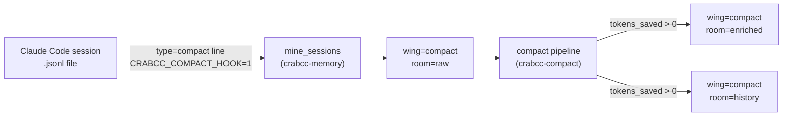
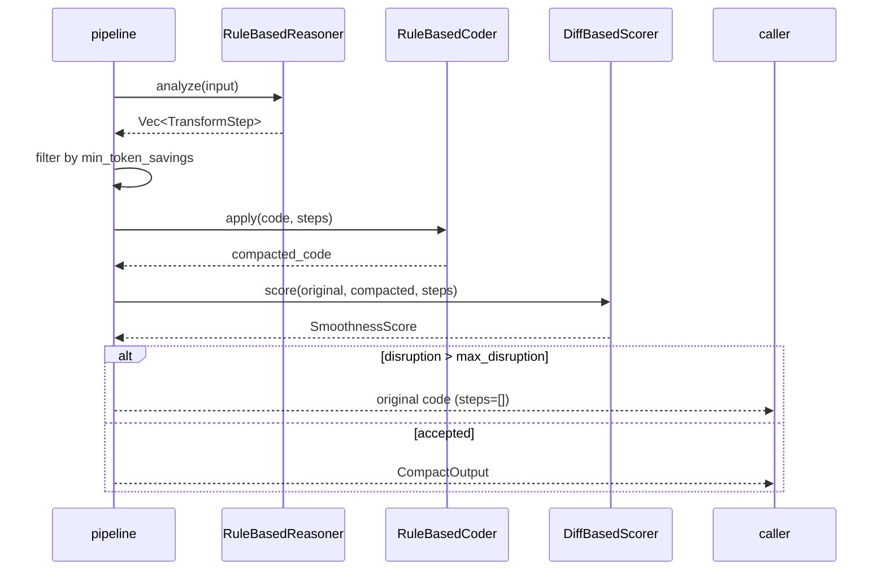

# Compact Hook

> Local-only code optimization pipeline gated behind `CRABCC_COMPACT_HOOK=1`: runs
> static-analysis rules, applies source rewrites, scores smoothness, and stores every
> result in the `crabcc-memory` wing `"compact"`.  No LLM or API calls are made.

---

## What it does (one picture)



The miner detects JSONL lines with `"type": "compact"` and stores a
lightweight summary in `room="raw"`.  Callers that want full enrichment
pass the input through `run_compact_with_history`, which writes the
`CompactDrawerBody` to `room="enriched"` and a per-file versioned entry
to `room="history"`.

---

## Architecture

### Module map

| Module | Purpose | Key types / functions |
|---|---|---|
| `types.rs` | Shared data model | `CompactInput`, `CompactOutput`, `TransformStep`, `TransformKind`, `CompactMetrics`, `SmoothnessScore`, `CompactDrawerBody`, `CompactContext` |
| `traits.rs` | Core trait interfaces | `Reasoner`, `Coder`, `SmoothnessEvaluator` |
| `compact_config.rs` | YAML configuration | `CompactConfig`, `CompactConfig::load()`, `CompactConfig::for_project()` |
| `tokens.rs` | Token counting heuristic | `count_tokens()`, `tokens_saved()` |
| `rules/redundancy.rs` | Detects repeated identical lines | `find()` |
| `rules/conditionals.rs` | Detects trivially constant conditions | `find()` |
| `rules/dead_code.rs` | Detects commented-out code blocks | `find()` |
| `rules/expressions.rs` | Detects constant-foldable expressions | `find()` |
| `rules/patterns.rs` | Detects whitespace-only lines | `find()` |
| `reasoner.rs` | Dispatches all rules | `RuleBasedReasoner` |
| `transforms/rewrite.rs` | Applies a single transform step | `apply_step()` |
| `coder.rs` | Chains transform steps | `RuleBasedCoder` |
| `smoothness.rs` | Scores output quality | `DiffBasedScorer` |
| `pipeline.rs` | Top-level orchestration | `run_compact()`, `run_compact_with_history()` |
| `history.rs` | Per-file versioned history | `append_history()`, `get_history()` |
| `compact_memory.rs` | Palace-backed store/list/stats | `store()`, `store_raw()`, `list()`, `compact_stats()` |

Modified files:

| File | Change |
|---|---|
| `crates/crabcc-memory/src/mine/sessions.rs` | Detects `type=compact` JSONL lines; stores in `wing="compact"` when `CRABCC_COMPACT_HOOK=1` |
| `crates/crabcc-cli/src/memory.rs` | Adds `CompactStats` subcommand |

---

### Pipeline flow

`run_compact()` in `pipeline.rs` runs these stages in order:

1. **Analyze** — `RuleBasedReasoner::analyze()` calls every rule's `find()` in sequence and collects all `TransformStep` proposals.
2. **Filter** — steps whose `tokens_saved < config.min_token_savings` are dropped.
3. **Apply** — `RuleBasedCoder::apply()` feeds the code through each remaining step via `rewrite::apply_step()`; a step that returns an error is logged and skipped, leaving the code unchanged for that step.
4. **Score** — `DiffBasedScorer::score()` computes a `SmoothnessScore` from the diff between the original and compacted code.
5. **Gate** — if `smoothness.disruption > config.max_disruption` the original code is returned and `steps` is cleared.



`run_compact_with_history()` wraps `run_compact()` and, when
`tokens_saved > 0`, calls `history::append_history()` to write a
versioned drawer to `wing="compact", room="history"`.

---

### Memory storage

All compact data lives in the `Palace` under `wing="compact"`:

| Room | Key pattern | Contents |
|---|---|---|
| `raw` | `compact:raw:{session_id}` | One-line summary (`session=… code_len=…`) written by `mine_sessions` |
| `enriched` | `compact:{session_id}` | Full `CompactDrawerBody` JSON |
| `history` | `history:{file_path}:saved={tokens_saved}` | Full `CompactOutput` JSON, one drawer per run |

`store_raw()` and `history::append_history()` are both no-ops unless
`CRABCC_COMPACT_HOOK=1` is set.  `store()` (enriched) has no env gate —
it is called only from application code that has already decided to
persist.

**`CompactDrawerBody` fields:**

| Field | Type | Description |
|---|---|---|
| `original` | `String` | Unmodified source code |
| `compacted` | `String` | Source after all accepted transforms |
| `steps` | `Vec<TransformStep>` | Applied transforms with per-step token savings |
| `metrics` | `CompactMetrics` | `tokens_before`, `tokens_after`, `tokens_saved`, complexity scores, `process_time_ms` |
| `smoothness` | `SmoothnessScore` | `disruption`, `readability`, `compatibility`, `preservation` (all `f64` in `[0, 1]`) |
| `context` | `CompactContext` | `file_type` and optional `project_scope` |

---

## Configuration

**File location:** `~/.crabcc/compact.yaml`
(override with `CompactConfig::load(Some(path))`)

| Field | Type | Default | Description |
|---|---|---|---|
| `enabled_rules` | `Vec<TransformKind>` | `[]` (all rules run) | Explicit allowlist of `TransformKind` variants; empty means all rules are active |
| `min_token_savings` | `u32` | `0` | Drop any step that saves fewer tokens than this threshold |
| `max_disruption` | `f64` | `1.0` | Reject the entire compacted output if `smoothness.disruption` exceeds this value (1.0 = never reject) |
| `per_project` | `HashMap<String, CompactConfig>` | `{}` | Project-key overrides; looked up via `CompactConfig::for_project(key)` |

**Per-project overrides example:**

```yaml
min_token_savings: 10
max_disruption: 0.3
per_project:
  my-service:
    min_token_savings: 5
    max_disruption: 0.5
```

---

## Usage

### Enable the hook

```bash
export CRABCC_COMPACT_HOOK=1
# mine-sessions now detects type=compact JSONL entries and stores them
crabcc memory mine sessions ~/.claude/projects/my-project/
```

### Query compact history

```bash
# List all enriched compact drawers
crabcc memory list --wing compact

# Search across compact drawers
crabcc memory search "optimization" --wing compact

# Aggregate statistics (total entries, tokens saved, avg readability)
crabcc memory compact-stats
```

### Rust API

```rust
use crabcc_compact::{
    pipeline::run_compact,
    compact_config::CompactConfig,
    types::CompactInput,
};

let input = CompactInput {
    session_id: "my-session".into(),
    original_code: source.to_string(),
    file_type: "rust".into(),
    project_scope: None,
};
let config = CompactConfig::load(None)?;          // reads ~/.crabcc/compact.yaml
let output = run_compact(input, &config)?;
println!("saved {} tokens", output.metrics.tokens_saved);
```

To also write history to a `Palace`:

```rust
use crabcc_compact::pipeline::run_compact_with_history;
use crabcc_memory::Palace;

let palace = Palace::open(None)?;
let output = run_compact_with_history(input, &config, &palace)?;
```

---

## Token counting

`tokens.rs` uses a whitespace + punctuation heuristic instead of
`tiktoken-rs`:

1. Split on whitespace — each word contributes approximately one BPE token.
2. Count punctuation characters (`{}();,.<>=!&|+-*/`); add one extra
   token per three characters to account for the dense single-character
   tokens that code produces.

**Tradeoff:** accuracy is ±15% on English prose and ±20% on code.  That
is precise enough for the "did this run save tokens?" comparison the
hook makes, while avoiding the ~25 MB ONNX runtime and pre-compiled BPE
vocab that `tiktoken-rs` would add to the binary.

The `tokens_saved` values in `CompactMetrics` and `TransformStep` are
computed from this proxy, so they should be treated as indicative
estimates rather than exact counts.

---

## Extending

### Adding a new rule

1. Create `crates/crabcc-compact/src/rules/my_rule.rs`.
2. Implement a `find(input: &CompactInput) -> Vec<TransformStep>` function.
   Return one `TransformStep` per opportunity found, with the appropriate
   `TransformKind` and a `tokens_saved` estimate from `tokens::count_tokens`.
3. Register the module in `rules/mod.rs`:
   ```rust
   pub mod my_rule;
   ```
4. Call it in `reasoner.rs` inside `RuleBasedReasoner::analyze()`:
   ```rust
   steps.extend(crate::rules::my_rule::find(input));
   ```
5. Add a rewrite branch in `transforms/rewrite.rs` matching the new
   `TransformKind` variant, or return `Ok(code.to_string())` with a
   comment explaining why the rewrite is deferred (as `ConditionalSimplification`
   does today).
6. Add the variant to `TransformKind` in `types.rs`.

### TransformKind variants

| Variant | Description |
|---|---|
| `RedundancyRemoval` | Remove consecutive duplicate lines |
| `ConditionalSimplification` | Simplify trivially constant conditions (`if true`, `if false`, etc.) — rewrite is currently a pass-through pending AST support |
| `ExpressionFolding` | Replace constant-foldable expressions (`x + 0`, `x * 1`, `1 + 0`) with their reduced form |
| `DeadCodeRemoval` | Remove commented-out code blocks (lines starting with `// ` that contain code keywords) |
| `PatternNormalization` | Collapse runs of three or more consecutive blank lines down to two |
| `WhitespaceComment` | Remove lines that contain only whitespace characters |
