# crabcc — visual overview

> Diagram-first map of the system. For prose traces and per-command mechanics see
> [README § Architecture](../README.md#architecture). For engine-room detail see
> [`crates/crabcc-core/docs/HOW_IT_WORKS.md`](../crates/crabcc-core/docs/HOW_IT_WORKS.md).

**Regenerate or extend:** run `/crabcc-generate-overview` in Claude Code (see
[`commands/crabcc/generate/overview.md`](../commands/crabcc/generate/overview.md)).

---

## 1. What crabcc is (one picture)

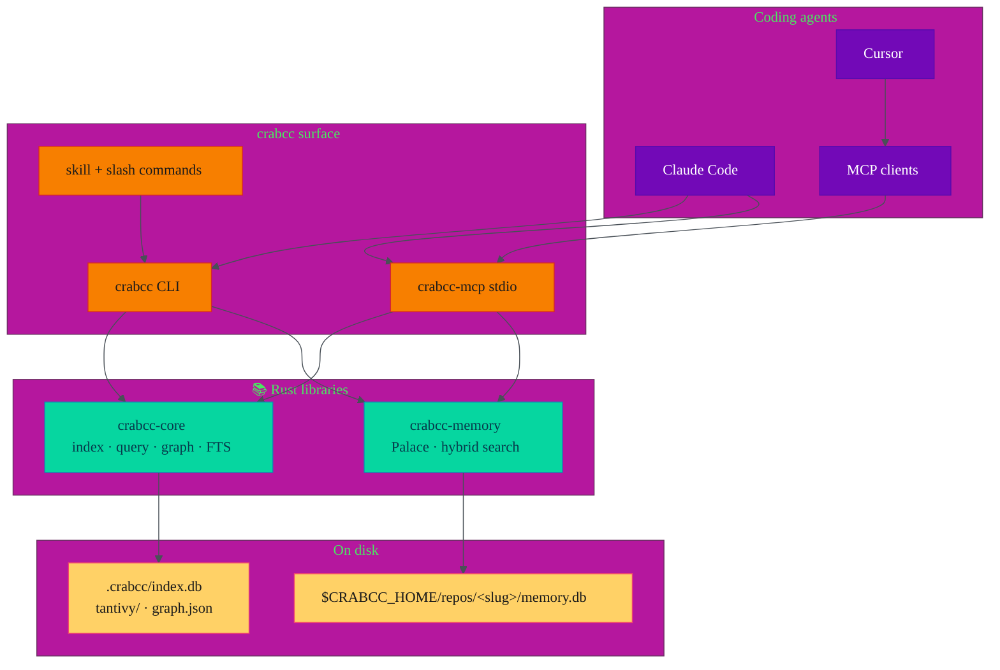

| Layer | Role |
|-------|------|
| **Agents** | Claude Code, Cursor, LangChain, etc. — never walk the repo with `grep -rn` for symbols |
| **Surface** | Thin dispatch: argv (CLI) or JSON-RPC 2.0 (MCP); same code paths |
| **Libraries** | `crabcc-core` = symbol index; `crabcc-memory` = per-repo drawers + hybrid retrieval |
| **Disk** | Repo-local index + home-dir memory (worktrees share memory by remote URL hash) |

---

## 2. Workspace map (crates & apps)

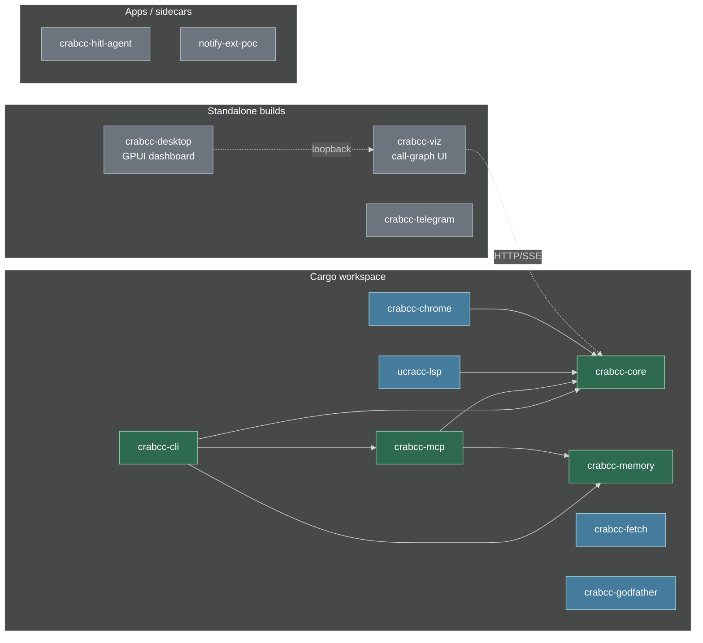

Excluded from the workspace (build in-crate): `crabcc-viz`, `crabcc-desktop`, `apps/crabcc-telegram` — see comments in root `Cargo.toml`.

---

## 3. Data on disk

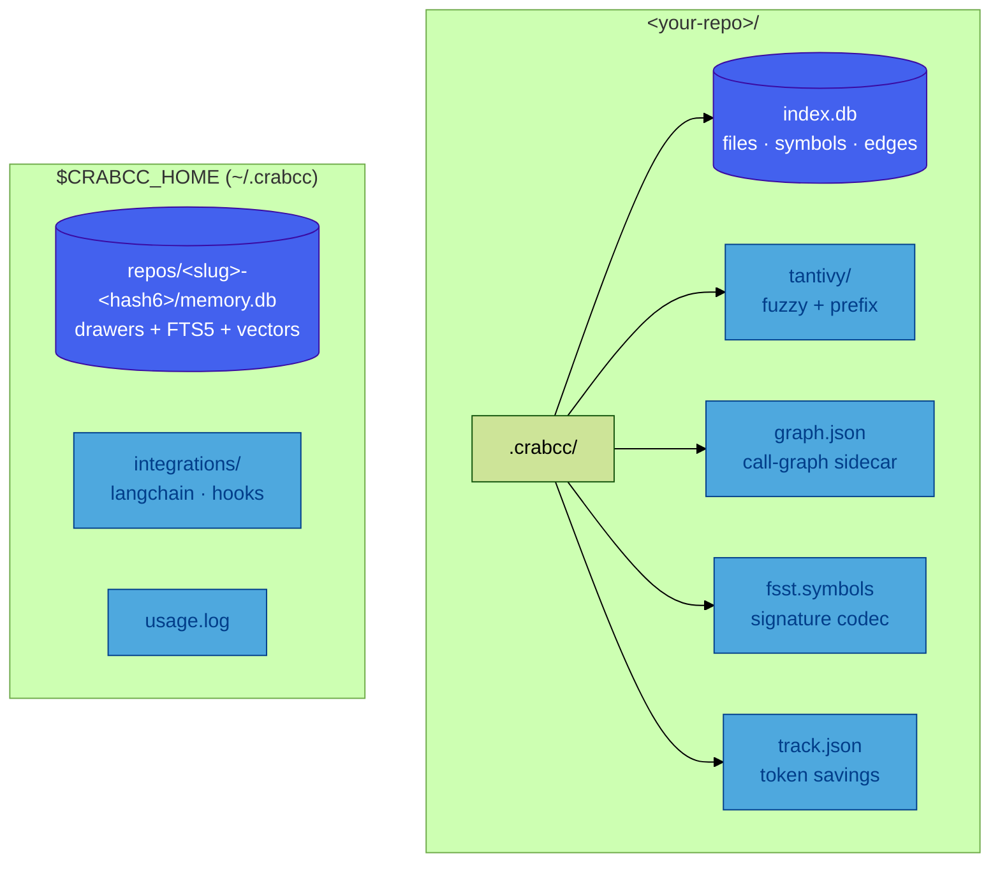

| Path | Built by | Queried by |
|------|----------|------------|
| `index.db` | `crabcc index` / `refresh` | `sym`, `refs`, `callers`, `outline`, `files` |
| `tantivy/` | index + `fts-rebuild` | `fuzzy`, `prefix` |
| `graph.json` | `crabcc graph build` | `graph walk`, viz, LSP call hierarchy |
| `memory.db` | `memory remember` / `mine` | `memory search` (hybrid RRF) |

---

## 4. Indexing pipeline

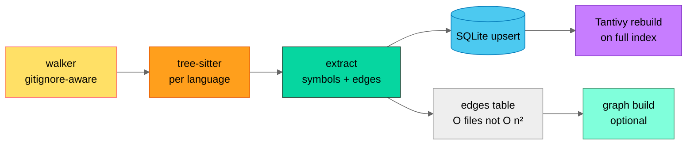

Languages today: TypeScript, TSX, JavaScript, Ruby, Rust, Go, Python (+ more via grammar crates in `Cargo.toml`).

---

## 5. Query router (which path runs?)

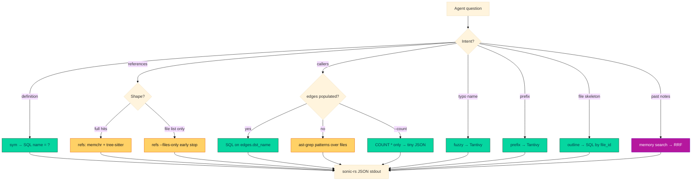

**Rule of thumb:** prefer `callers --count` and `refs --files-only --limit N` before full scans — token-shaped output is the product feature.

---

## 6. Memory: hybrid search (RRF)

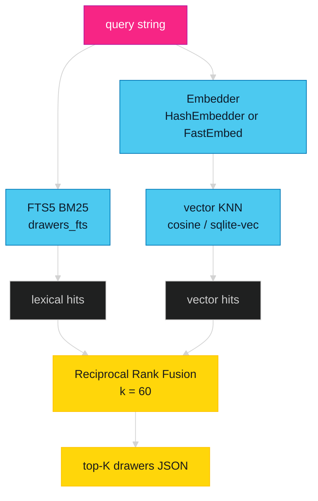

Modes: `hybrid` (default with embeddings), `lexical`, `vector` — see `crabcc memory search --mode`.

---

## 7. Agent integrations

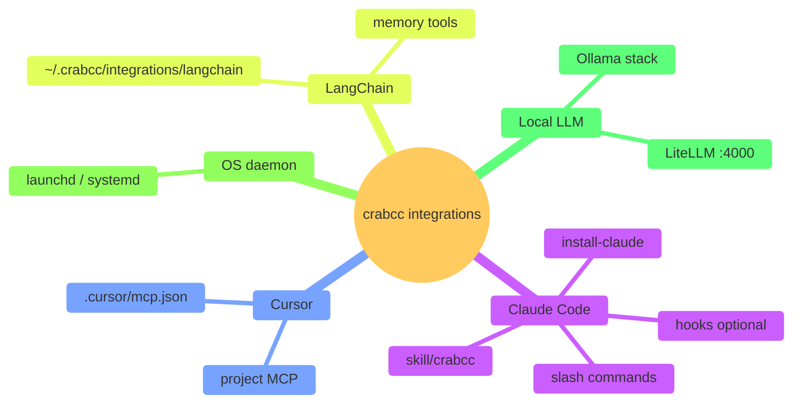

Install everything:

```bash
crabcc setup install-integrations --target all --project --yes
```

Guide: [`install/integrations.md`](../install/integrations.md).

---

## 8. Ollama agent stack

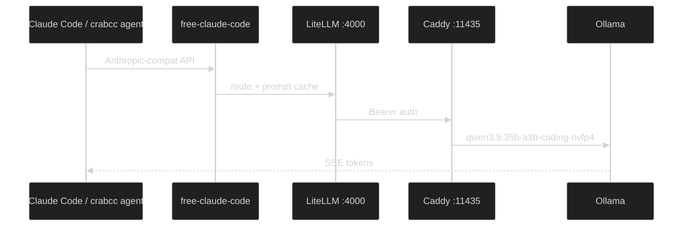

Bootstrap: `task setup` · Run: `crabcc agent --run "…" --backend ollama`

---

## 9. CLI vs MCP (same engine)

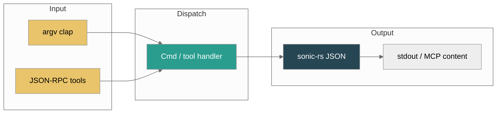

MCP tools mirror CLI subcommands (`sym`, `refs`, `callers`, `memory.*`, …). Optional `cwd` on memory tools walks up to `.git` for the correct palace.

---

## 10. Performance snapshot (why agents care)

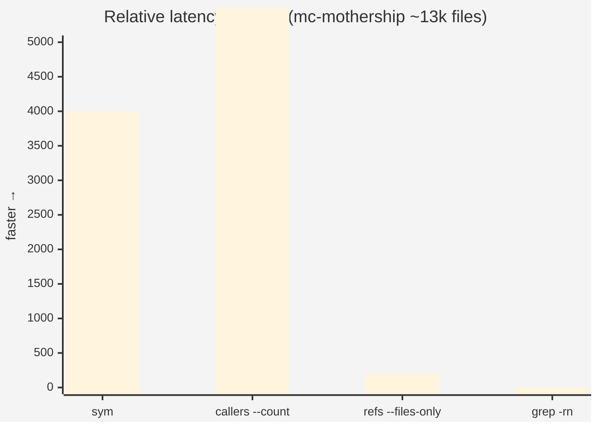

| Output shape | Typical size vs grep |
|--------------|----------------------|
| `sym Foo` | typed JSON, µs–ms |
| `callers X --count` | ~14 bytes |
| `refs X --files-only --limit 5` | hundreds of bytes vs MB of text |

Full tables: [README § Bench results](../README.md#bench-results-mc-mothership-13k-indexed-files).

---

## 11. Session bootstrap (`crabcc go`)

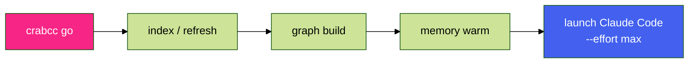

One command to index, build the call graph, and open Claude with the skill loaded.

---

## 12. Doc map (where to read next)

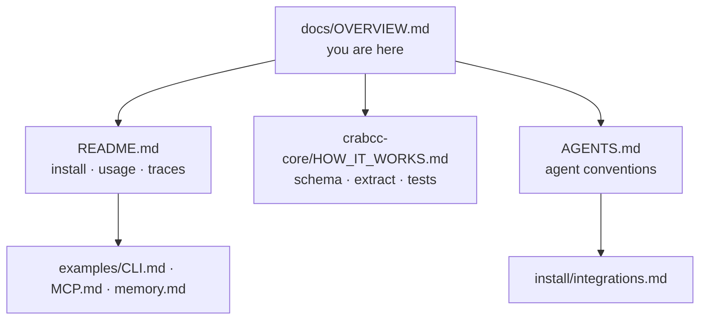

---

## Legend

| Symbol | Meaning |
|--------|---------|
| 🦀 | Rust crate or binary |
| 💾 | Persistent store |
| 🤖 | External coding agent |
| Solid arrow | compile-time or direct call |
| Dotted arrow | HTTP/SSE / optional integration |

*Last updated with repo architecture at v4.x. Diagrams render on GitHub, in Cursor, and in Claude Code markdown previews.*
