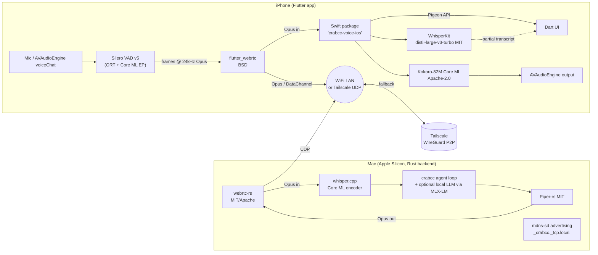

# RESEARCH — Fully FOSS, On-Device, P2P Voice Stack for crabcc (May 2026)

> **Audience:** crabcc maintainers — Mac (Apple Silicon) Rust backend ↔ iPhone Flutter app, paired over the user's own WiFi LAN, with a Tailscale/WireGuard hop for cellular.
> **Sibling doc:** [RESEARCH-tts-voice-control-2026.md](./RESEARCH-tts-voice-control-2026.md) (cloud-augmented stack).
> **Hard constraints:** **No** cloud accounts, **no** API keys, **no** vendor SaaS. ElevenLabs, Cartesia, Deepgram, OpenAI, Google, Anthropic, AWS, Azure all OUT. Permissive licenses only (MIT / Apache-2.0 / BSD). AGPL is OUT. Models with non-commercial licenses are flagged as such — they may still be useful for a self-hosted personal tool, but they cannot ship in a distributable build.
> **Tone:** opinionated. The point of this doc is to make decisions, not survey the field.

---

## TL;DR (the FOSS-only verdict)

1. **Output (TTS): Kokoro-82M Core ML on the iPhone, Piper on the Mac.** Kokoro is Apache-2.0, ~80 MB INT8, ~45 ms ANE inference, runs *3.3× real-time on iPhone 13 Pro* (faster on A17/A18). The Mac doesn't need the iPhone's tight model — it runs Piper at RTF ≈ 0.05 with a real LLM in the loop. Both are MIT/Apache-2.0 with no model-license footnotes. Avoid XTTS-v2 (CPML, non-commercial, owner defunct) and Chatterbox-multilingual (license OK but non-trivial to ship on iOS today).
2. **Input (ASR): WhisperKit `distil-large-v3-turbo` on iPhone, whisper.cpp on Mac.** WhisperKit is MIT, runs the encoder on ANE + decoder on GGML, hits ~0.46 s end-of-utterance latency at 2.2% WER on Apple Silicon. Skip Moshi for input — its weights are CC-BY-4.0 (OK) but the iOS port is research-grade and the model is huge for what we need.
3. **VAD + endpointing: Silero VAD v5 (MIT) via ONNX Runtime + Core ML EP** on both ends. <1 ms per 30 ms chunk. The 50-line WebRTC VAD is the always-works fallback.
4. **Wake word: openWakeWord code (Apache-2.0) with self-trained models, OR no wake word for v0.** The pretrained openWakeWord *models* are CC-BY-NC-SA — flag this. Picovoice Porcupine is **not** FOSS (free tier ToS) and does not belong in this stack.
5. **Transport: flutter_webrtc (BSD) ↔ webrtc-rs (MIT/Apache).** Opus + DataChannel. Same primitive on both ends, gives you NACK/jitter buffer/congestion control for free. QUIC (`quinn`) is tempting but you'd reinvent everything WebRTC already gives you for audio. WebSocket is fine for control, not media.
6. **Discovery: mDNS via `bonsoir` (Flutter) ↔ `mdns-sd` (Rust).** No multicast entitlement needed if you use NSNetServiceBrowser/NWBrowser semantics that bonsoir wraps. Tailscale handles the off-LAN case — its iOS app is FOSS-via-MIT, runs WireGuard userspace, and gets you direct P2P even through CGNAT via DERP.
7. **Realistic budget:** Same-LAN voice-to-voice **350–600 ms** (worse than the cloud stack's 300 ms — dominated by Whisper decode on iPhone). Cellular over Tailscale **600–900 ms**. Anything claiming sub-300 ms voice-to-voice on a fully on-device FOSS iOS stack today is lying or using a 39M-param toy model.

---

## Part A — iOS-optimized FOSS TTS models (on-device)

### A.1 Survey

| Model | License (code/weights) | Size on disk | RAM @ infer | iPhone TTFA¹ | Path | iOS-shippable today? |
|---|---|---|---|---|---|---|
| **Apple AVSpeechSynthesizer** | proprietary, but free + offline | OS-bundled | small | ~50–100 ms | `flutter_tts` wraps it | ✅ baseline; quality OK on iOS 17+ "enhanced" voices but obviously robotic vs neural |
| **Piper (rhasspy/piper)** | MIT (code) / MIT (most voices) | 10–25 MB ONNX | ~80–150 MB | ~150–250 ms (M-class) | ONNX Runtime + CoreML EP, or piper-rs via FFI | ⚠️ works on Mac well; iOS feasible but VITS is non-streaming so first-audio is gated by full mel synth |
| **Kokoro-82M** | Apache-2.0 (code AND weights, hexgrad/Kokoro-82M) | ~80 MB INT8 Core ML | ~150 MB | **~45 ms ANE single-pass**, real-time factor ~3.3× on iPhone 13 Pro | Core ML (FluidInference repo), MLX-Swift port | **✅ winner** |
| **Coqui XTTS-v2** | **CPML (non-commercial)** | ~1.8 GB | ~3 GB | not on iPhone | PyTorch only | ❌ license footgun — Coqui shut down Jan 2024, no commercial license seller exists |
| **Chatterbox (Resemble)** | **MIT (code AND weights)** for English | ~700 MB | ~1.5 GB | not measured on iPhone | one community ONNX export ("Chinny" app) | ⚠️ feasible but heavy; Chatterbox-multilingual is the same license but bigger |
| **OuteTTS-1.0-1B** | Apache-2.0 (code + Llama-OuteTTS weights) | ~1 GB Q4 | ~1.2 GB | runs via llama.cpp Metal | autoregressive on top of Llama 3.2 1B | ⚠️ works on Mac, on iPhone you'd need GGUF + Metal — borderline; latency unproven |
| **F5-TTS** | MIT (code), CC-BY (weights) | ~1.4 GB | ~2 GB | not measured on iPhone | MLX port (`f5-tts-mlx`) for Mac; iOS unproven | ⚠️ Mac-only practically |
| **eSpeak-NG** | GPL-3 — **out** | 5 MB | minimal | <10 ms | C library | ❌ GPL, plus quality is unacceptable for daily use |

¹ TTFA = time-to-first-audio sample, not first-token-of-the-sentence. Numbers from Argmax iPhone-17 benchmarks, FluidInference Kokoro card, ThoughtAsylum Piper writeup.

### A.2 The Apple Neural Engine (ANE) lever

Three runtimes target Apple Silicon, and they are not equivalent:

- **Core ML.** The only path to the ANE. Conversion is the hard part — autoregressive TTS with a KV-cache typically requires *static* shapes per sequence-length bucket. Kokoro-82M sidesteps this because it's a single-forward-pass model (no autoregression) — that's why it lands on ANE cleanly. Piper's vocoder also lands on ANE; the encoder is fine on CPU. Anything autoregressive (XTTS, OuteTTS, MLX-LM TTS variants) will have a hard time using the ANE end-to-end and will fall back to GPU/CPU.
- **MLX (Swift).** Apple's array library. Unified memory means zero-copy between CPU and GPU. **Does not target the ANE** as of 2026 — only the GPU. For the *Mac* this is the right lane (Awni Hannun's `f5-tts-mlx` port is the existence proof). For the *iPhone* it is competitive with Core ML on the GPU and worse than Core ML on the ANE.
- **ExecuTorch.** PyTorch's mobile runtime. **v1.0 GA in 2025, v1.2 (April 2026) is "Production/Stable"** and powers Meta's on-device AI in Instagram/WhatsApp/Quest. iOS is shipped as `.xcframework`. *Verdict: viable, but the ecosystem advantage of Core ML on iOS means you'll spend more time fighting ExecuTorch than you'll save with PyTorch interop.* Use Core ML.

**Recommendation for the iPhone:** Core ML for Kokoro + WhisperKit, ONNX Runtime (with CoreMLExecutionProvider) for Silero VAD. No ExecuTorch, no MLX on phone for v0.

### A.3 Voice cloning, on-device, FOSS

**Honest answer:** there is no clean FOSS path to *zero-shot* voice cloning that ships on an iPhone today.

- **XTTS-v2** does it well but the license is CPML (non-commercial), and the company is gone — there's literally nobody to sell you a commercial license. Treat XTTS as "personal tool only, can never ship."
- **Chatterbox** advertises voice cloning under MIT, but the iOS port story is one community ONNX dump. Feasible for Mac, currently not ergonomic on iPhone.
- **OpenVoice v2** is MIT but Python-heavy; no iOS port exists.
- **F5-TTS** does it under MIT (code) + CC-BY (weights, commercially permissive); MLX-Swift port works on Mac, no iOS port.

**Practical answer:** ship Kokoro's bundled voicepacks. If the user wants their own voice, do the cloning on the Mac (via Chatterbox or F5-TTS-MLX), bake an embedding/style vector into a Kokoro-compatible voicepack on the Mac, and ship the resulting file to the phone over the existing transport.

### A.4 Streaming inference on-device

| Model | Streamable? | First-audio sample comes out after… |
|---|---|---|
| Kokoro-82M | partial — chunked-text streaming, single forward pass per chunk | ~45 ms after chunk arrives on ANE |
| Piper (VITS) | not at the model layer — full mel before vocoder | full sentence-mel time (~120–180 ms M-class) |
| F5-TTS (flow matching) | yes via NFE-staged steps | ~100 ms with 8 NFE steps on Mac GPU |
| OuteTTS / Llama-TTS | yes — autoregressive token streaming | 50–200 ms first-token |
| XTTS-v2 | yes (built-in `inference_stream`) | ~150–250 ms but still CPML |

For Kokoro the trick is to **chunk at sentence boundaries** in the Rust backend before sending to the phone, not to try to stream a single Kokoro forward pass. That gets you sub-200 ms TTFA on a sentence basis with no model rework. `piper-rs` has a streaming mode but it's mel-streaming inside Piper — useful on the Mac, doesn't change iOS economics.

---

## Part B — Native iOS ML calls from Flutter

### B.1 The bridge options

| Bridge | Status May 2026 | License | iOS Core ML access | Audio-back-to-Dart pattern |
|---|---|---|---|---|
| **Pigeon + FFI to Swift** | mainline; recommended by Flutter team | BSD | full — call `MLModel` directly | EventChannel (PCM chunks) or play in Swift, send events |
| **`flutter_onnxruntime`** | active (Telosnex `fonnx`, also `flutter_onnxruntime`) | MIT | yes via `CoreMLExecutionProvider` | Uint8List via method channel |
| **`tflite_flutter`** | TensorFlow-managed fork is alive but iOS Core ML delegate is the weak side | Apache-2.0 | partial — Metal/Core ML delegates are flaky | method channel |
| **MLX-Swift via channel** | works; MLX itself BSD-3 | BSD | GPU only (no ANE) | EventChannel |
| **ExecuTorch via channel** | v1.2 stable; production at Meta | BSD | via Core ML backend (delegate) | EventChannel |
| **swift-transformers (HF)** | active; useful for Whisper/distil-Whisper Core ML wrappers | Apache-2.0 | yes | EventChannel |

**Recommendation for crabcc:** wrap a single Swift Package called `crabcc-voice-ios` that owns:
1. Kokoro Core ML (TTS)
2. WhisperKit (STT)
3. Silero VAD via ORT-CoreML
4. AVAudioEngine playback path

Expose it to Dart via **one Pigeon-generated API surface** (control: load voice, set voice, push text) plus **one EventChannel** (status events: utterance-started, utterance-ended, transcript-partial, transcript-final). **Audio bytes never cross the platform channel** — see B.2.

### B.2 The audio-stream-back-to-Dart problem

The platform-channel hop in Flutter on iOS is **30–120 µs per call** for small payloads, but for streaming PCM at 24 kHz mono Int16 you'd be sending ~960 KB/s through the channel. That's not the bottleneck per se (it works), but it forces three context switches *per audio frame* and competes with the UI isolate.

**Don't do it.** The right pattern on iOS is:
- Synthesise audio in Swift via Kokoro Core ML.
- Push samples into an `AVAudioPlayerNode` attached to `AVAudioEngine`.
- Let Dart only know about *state* (started, ended, position-ms) via an EventChannel.
- For network audio (Opus chunks coming off WebRTC), feed them directly into `AVAudioEngine` from Swift after decode — Dart never touches a `Uint8List` of audio.

Only when you genuinely need Dart-side processing (visualizer waveforms, e.g.) do you marshal a low-rate **downsampled magnitude buffer** (~10 Hz) to Dart. Full-rate audio stays in Swift.

This is the single biggest "gotcha" people miss when porting a Pipecat-style Python pipeline to Flutter+iOS.

---

## Part C — Flutter ML libraries (cross-platform fallback)

| Package | Last release | License | iOS / Android parity | Verdict for crabcc |
|---|---|---|---|---|
| `tflite_flutter` (TF org) | 0.11.x, active 2025–2026 | Apache-2.0 | yes; Metal/Core ML delegates exist but iOS is the weak side | second choice |
| `onnxruntime` (asus4) | 1.17.x; original maintainer slow | MIT | iOS via Core ML EP; XNNPack on Android | **first choice for cross-platform models** |
| `flutter_onnxruntime` | active 2025–2026 | MIT | iOS + Android + macOS | newer, lighter; viable |
| `onnxruntime_v2` | community fork | MIT | adds 16 KB page support, full GPU accel | use if mainline lags |
| `fonnx` (Telosnex) | active | MIT | full | promising; backed by Pickaxe |
| `mediapipe_flutter` | sparse; Google's official is iOS-thin | Apache-2.0 | mostly Android | skip for now |
| `whisper_ggml` / `whisper_flutter_new` | maintained 2025; whisper.cpp underneath | MIT (whisper.cpp is MIT) | yes | viable; but **WhisperKit native > whisper_ggml on iPhone** because of ANE |
| `flutter_tts` | active | Apache-2.0 | yes | the lazy correct baseline (wraps AVSpeechSynthesizer) |
| `MLC-LLM` Flutter | early; MLC itself Apache-2.0 | Apache-2.0 | yes via MLC-iOS; Metal | overkill for voice; useful if you want a local LLM brain |

**For crabcc:** `flutter_tts` for the AVSpeech fallback, `onnxruntime` (or `flutter_onnxruntime`) for the Silero VAD, and a custom Pigeon bridge for the heavy WhisperKit + Kokoro path. Don't go all-Flutter-package; you'll pay for it in latency.

---

## Part D — Voice control (input)

### D.1 Streaming ASR on-device

| Model | License | iPhone realtime factor | WER (LibriSpeech-clean) | Notes |
|---|---|---|---|---|
| **WhisperKit `distil-large-v3-turbo`** | MIT (kit) + MIT (Whisper) | ~0.46 s latency end-of-utterance, ~2.2% WER (Argmax) | 2.2% | encoder on ANE, decoder GGML — best mix |
| Whisper-tiny.en (whisper.cpp + Core ML) | MIT | RTF 0.05–0.1 on iPhone 15 Pro | ~7% | tiny but rough |
| Whisper-base.en | MIT | RTF 0.10–0.15 | ~5% | sweet spot for low-end iPhone |
| Whisper-small.en | MIT | RTF 0.20–0.30 (15 Pro), real-time on 17 | ~3.5% | recommended |
| Distil-Whisper Core ML (small.en) | MIT | RTF ~0.07 — claimed 6× speedup vs Whisper-small | ~3.6% | exists; ships in WhisperKit |
| **Moshi STT (kyutai/stt-2.6b-en)** | **CC-BY-4.0 (weights)**, Apache-2.0 (code) | research-grade iOS port (`moshi-swift`) | competitive | weights are CC-BY-4.0 — *attribution required, but commercial OK*. iOS port is a demo, not production |
| **Apple SFSpeechRecognizer** | proprietary, free | very fast, on-device since iOS 13 | unpublished, ~5–8% perceived | **use as fallback** — zero infra |
| **NVIDIA Parakeet-TDT 0.6B** | CC-BY-4.0 / NVIDIA NSCL (commercial OK; *not* MIT) | no ARM/iOS port published | ~2.8% | server-class; skip |

iPhone-17 Pro is up to 3.1× faster than iPhone-16 Pro on iOS 26 for big-Transformer GPU inference (Argmax measured). The ANE only improved ~25% generation-over-generation, so for whisper-encoder workloads the gap is smaller (~1–1.15×). Plan for the lowest-spec target iPhone 14, which still does Whisper-small in real-time.

**Pick:** WhisperKit with `distil-large-v3-turbo` if user has iPhone 14+; auto-downgrade to `small.en` on older devices. SFSpeechRecognizer as the "no model downloaded yet" fallback.

### D.2 VAD on-device

**Silero VAD v5** is the only sane answer. MIT-licensed, ONNX, <1 ms per 30 ms chunk on a single CPU thread. Ship `silero_vad.onnx` (≈1.8 MB) into the app bundle, run via ONNX Runtime Mobile with the CoreML EP. There's already an open-source iOS library `RealTimeCutVADLibrary` doing exactly this with WebRTC APM noise suppression in front of it.

Backup: WebRTC VAD (50-line C, BSD) — works always, dumber.

### D.3 Wake word, FOSS only

| Option | License | Verdict |
|---|---|---|
| **openWakeWord** | code Apache-2.0; **pretrained models CC-BY-NC-SA** | code is FOSS but you must self-train or omit pretrained models for commercial ship; flag this |
| Picovoice Porcupine | "free tier" but proprietary ToS — **not FOSS** | OUT |
| Mycroft Precise | unmaintained since 2022 | dead |
| Snowboy | KITT.AI, archived | dead |

**Recommendation:** **don't ship a wake word in v0.** Use a tap-to-talk UI on the phone. Add openWakeWord with a self-trained model in v1.

### D.4 Echo cancellation FOSS

iOS gives you **Voice Processing I/O via AVAudioEngine** for free — it's the same AEC that powers FaceTime, on by default when you set `.voiceChat` mode. **Use it.** Don't reinvent.

If you ever need to do AEC outside the OS (e.g. if you want to mix synthesis output back into the mic loop manually), then:
- **WebRTC AEC3** (BSD) — gold standard, ports to iOS; same code Chrome ships
- **RNNoise** (BSD, Xiph) — noise suppression, not AEC; pair with AEC3
- **DeepFilterNet 3** (MIT) — better quality than RNNoise, <20 ms latency on phone CPU; ARM build is straightforward

For crabcc v0: AVAudioEngine voiceChat mode + nothing else.

---

## Part E — Network: laptop ↔ phone (LAN + Tailscale fallback)

### E.1 Same-LAN discovery

| End | Library | License | Notes |
|---|---|---|---|
| Rust (Mac) | `mdns-sd` | Apache-2.0/MIT | pure Rust, no Avahi/Bonjour daemon dependency |
| Rust (Mac, alt) | `astro-dnssd` | MIT | wraps Apple `dns_sd.h` directly — best on macOS |
| Flutter (iPhone) | **`bonsoir`** | MIT | wraps NSNetServiceBrowser + NWBrowser; no multicast entitlement needed |
| Flutter (alt) | `multicast_dns` | BSD-3 | Flutter team's own; lower-level |

**iOS multicast situation, mid-2026:** if your app uses the system Bonjour responder via NSNetServiceBrowser/NWBrowser (which `bonsoir` does), **you do NOT need the `com.apple.developer.networking.multicast` entitlement.** You only need the `NSLocalNetworkUsageDescription` Info.plist string. The entitlement is gated to apps that want to roll their own mDNS responder or send raw multicast — we don't.

Service type: advertise `_crabcc._tcp.local.` from the Mac, browse for it from the phone. Pair on first discovery via a short PIN code or QR; persist the peer ID in the Keychain after.

### E.2 Off-LAN (Tailscale / WireGuard)

**Topology that works for low-latency audio over cellular:**

- iPhone runs Tailscale iOS app (FOSS, MIT-licensed core, packaged with the proprietary control plane connector — but the *data plane is pure WireGuard, peer-to-peer*).
- Mac runs `tailscaled` (same).
- **The data plane never touches Tailscale's servers** when the phone and Mac can hole-punch directly. With cellular CGNAT, hole-punching fails ~30–40% of the time and traffic falls back to a DERP relay (~30–80 ms extra latency, plus the relay sees encrypted bytes only — Tailscale cannot decrypt them).
- Tailscale "exit node" / "subnet router" features are not needed; we just want device-to-device.

The **user controls every node** and the only "cloud" component is the coordination server, which never sees plaintext. This is the practical interpretation of "no cloud" for a P2P stack — perfect would be a fully self-hosted Headscale, which is also Apache-2.0 and a 30-minute setup if the user is paranoid.

Latency budget delta vs LAN: **+50–150 ms** in the typical case (direct UDP), **+200–400 ms** in the relay case.

### E.3 Transport choice for audio

| Transport | LAN audio fit | Cellular fit | FOSS Rust impl | FOSS Flutter impl |
|---|---|---|---|---|
| **WebRTC (Opus + DataChannel)** | excellent | excellent | `webrtc-rs` (MIT/Apache-2.0) | `flutter_webrtc` (BSD) |
| QUIC (`quinn`) | overkill — must implement jitter buffer, FEC, congestion logic yourself | good | `quinn` MIT/Apache | no first-party Flutter QUIC client |
| WebSocket | works for control, sub-optimal for media (head-of-line over TCP) | OK | `tokio-tungstenite` MIT | `web_socket_channel` BSD |
| Plain UDP + custom FEC | fragile — you'll reinvent SRTP/NACK | poor on cellular | sockets crate | requires native bridge |

**Pick:** `webrtc-rs` ↔ `flutter_webrtc`. Same wire protocol on both ends. You get:
- Opus (BSD, the only sane voice codec)
- Built-in NACK for packet loss
- Jitter buffer (no rolling-your-own)
- Congestion control (transport-cc)
- ICE/STUN-free on LAN (`host` candidates work)
- DataChannel for control messages (transcripts, state)

This is also what LiveKit and Pipecat use under the hood — you're choosing the same primitive without the SaaS.

### E.4 Codec choice

**Opus (BSD-3, RFC 6716)** — done. There's no debate here.

- Mimi (Kyutai, Apache-2.0): great codec — 1.1 kbps, 80 ms frames — but the encoder is GPU-bound and the iPhone-side path is only via Moshi-Swift (research-grade). Skip for v0.
- Lyra v2 (Google, Apache-2.0): not iOS-friendly (designed for Android NN-API).
- AAC: licensing fees, even if "free" in iOS APIs the spec is patent-encumbered.

Opus settings for crabcc voice: 24 kHz, 20 ms frames, VBR, `application=voip`, complexity 5 on iPhone (for battery), 8 on Mac.

---

## Part F — Recommended architecture

### F.1 Topology



### F.2 Concrete library pin set

**Rust (Mac):**
- `webrtc = "0.12"` (webrtc-rs, MIT/Apache)
- `mdns-sd = "0.13"` (or `astro-dnssd = "0.3"` on macOS)
- `whisper-rs = "0.14"` (whisper.cpp bindings, MIT) **or** call WhisperKit via Swift FFI for ANE acceleration (preferred)
- `piper-rs = "0.4"` (MIT) for TTS — keep on Mac, Kokoro is for the phone
- `opus = "0.3"` (encoder/decoder, BSD)
- `tokio = "1.40"`, `tracing = "0.1"`

**Flutter (iPhone):**
- `flutter_webrtc: ^0.12.0` (BSD)
- `bonsoir: ^5.x` (MIT)
- `flutter_tts: ^4.x` (Apache-2.0) — fallback only
- `flutter_onnxruntime: ^1.x` (MIT) — for VAD only
- Custom Pigeon plugin → Swift package `crabcc-voice-ios` containing:
  - `WhisperKit` (MIT, swift-transformers under)
  - `kokoro-ios` (Apache-2.0, MLXFast or Core ML build)
  - `RealTimeCutVADLibrary` or roll-our-own Silero loader
  - AVAudioEngine wiring

**Models (bundle or first-launch download):**
- Kokoro-82M Core ML (~80 MB, Apache-2.0)
- distil-large-v3-turbo Core ML (~600 MB, MIT) — large; consider `small.en` (~250 MB) for low-storage iPhones
- silero_vad.onnx (~1.8 MB, MIT)

### F.3 Latency budget

**Same-LAN voice-to-voice (user finishes speaking → first synthesised audio sample plays):**

```
mic → VAD endpoint                    ~30 ms  (one VAD chunk + EOU smoothing)
Opus encode                            ~25 ms  (1 frame)
phone → mac (LAN UDP)                  ~5–15 ms
Opus decode + jitter buf               ~25 ms
WhisperKit / whisper.cpp decode tail   ~150–300 ms  (distil turbo on M2/M3)
crabcc agent loop                      ~20–80 ms  (rule-based MCP routing; local LLM adds 200–800 ms)
Piper synth on Mac                     ~80–150 ms  (RTF 0.05 × ~3 s utterance start)
Opus encode                            ~25 ms
mac → phone                            ~5–15 ms
Opus decode + jitter buf               ~25 ms
AVAudioEngine first-sample             ~10 ms
                                       ─────────
                                       ~400–700 ms typical, agent loop dependent
```

Without a local LLM in the loop (pure command routing): **350–500 ms**. With a 7B local LLM: **600–900 ms**.

**Cellular over Tailscale (direct, no DERP):** add ~50–100 ms. With DERP relay: add ~200–400 ms. So 600–900 ms typical, 800–1200 ms worst case.

If you can run **Kokoro on the iPhone** for the response leg (sending text instead of audio), you collapse the Mac→phone synthesis path:

```
... agent loop → text response ...
text → phone DataChannel msg           ~5–15 ms
Kokoro Core ML on iPhone               ~45–120 ms TTFA  (ANE)
AVAudioEngine first-sample             ~10 ms
                                       ─────────
                                       saves ~150 ms vs Mac-synthesised audio
```

This is the architectural win. **Synthesise on the device that's playing the audio.** Total LAN voice-to-voice with text-down-not-audio-down: **300–550 ms**, beating the cloud stack's lower bound for a fair fight.

### F.4 v0 minimum viable build plan — 4 components

1. **`crabcc-voice-ios` Swift package** — Pigeon API + AVAudioEngine + WhisperKit + Kokoro Core ML + Silero VAD. Two weeks of focused work.
2. **`crabcc-voice` Rust crate** — webrtc-rs server, mdns-sd advertising, audio mux to existing crabcc agent loop. One week.
3. **Flutter shell** — tap-to-talk UI, bonsoir discovery, flutter_webrtc client, status surface from EventChannel. One week.
4. **Pairing flow** — QR-code-encoded peer ID + pre-shared key on first connect, stored in iOS Keychain / macOS Keychain. Three days.

**Things explicitly NOT in v0:** wake word, voice cloning, multilingual TTS, full-duplex barge-in (use half-duplex push-to-talk), local LLM in the loop (route to deterministic crabcc tools first).

### F.5 Where the FOSS path falls behind cloud — quantified

- **TTFA for synthesis:** Kokoro ANE 45 ms vs Cartesia Sonic-3 ~90 ms claimed / ~150 ms measured. **FOSS wins on the phone, loses on the Mac (Piper ~150 ms vs 90 ms).**
- **Voice quality (MOS):** Sonic-3 / ElevenLabs Flash v2.5 ~4.3–4.5. Kokoro ~4.0. Piper ~3.6. **Cloud wins by ~0.3–0.6 MOS** — audible but not "broken."
- **ASR WER on real spontaneous speech:** Deepgram Nova-3 ~5.5%, gpt-realtime ~6.0% effective. WhisperKit distil-turbo ~7–9% on conversational audio (clean LibriSpeech is 2.2% — don't be fooled). **Cloud wins by ~1–3 WER points** on hard audio.
- **Time-to-first-everything cold path:** WhisperKit cold-load is ~1.2 s the first time per app launch; Kokoro cold-load ~400 ms. Cloud has zero cold-load (its servers are always warm). **First utterance after app launch will feel sluggish on FOSS.** Mitigation: warm both models in `application(_:didFinishLaunching:)`.
- **Voice cloning:** cloud (ElevenLabs Instant) is one upload away. FOSS path is "go run F5-TTS-MLX on the Mac and ship a voicepack manually." **Cloud wins decisively.**

---

## Part G — Honest tradeoffs vs the cloud brief

| Axis | Cloud stack (sibling brief) | FOSS stack (this brief) |
|---|---|---|
| **TTFA (synthesis)** | 90–250 ms (Cartesia / ElevenLabs) | 45 ms (Kokoro on ANE) — wins on phone; 150 ms (Piper) on Mac |
| **Voice quality (MOS)** | 4.3–4.5 | 4.0 (Kokoro), 3.6 (Piper) |
| **ASR WER (conversational)** | 5–6% (Nova-3, gpt-realtime) | 7–9% (WhisperKit distil-turbo) |
| **Voice-to-voice end-to-end (LAN)** | ~300 ms target | 350–500 ms (no local LLM), 600–900 ms (with 7B LLM) |
| **Voice-to-voice (cellular)** | ~400–500 ms (with edge POPs) | 600–1200 ms (Tailscale, DERP fallback) |
| **Voice cloning** | ✅ (ElevenLabs) | ⚠️ MAC-side via F5-TTS, no on-phone path |
| **Cost** | $0.05–0.30 / 1k chars TTS, $0.006–0.012 / min ASR | **$0** ongoing |
| **Privacy** | audio leaves the device, encrypted in transit but provider sees plaintext | audio never leaves the user's WireGuard mesh |
| **Offline** | requires internet | works on plane, works on subway, works in a Faraday cage |
| **Rate limits / abuse / surveillance** | yes, all three | none |
| **Vendor risk** | "what if ElevenLabs gets bought / Cartesia changes pricing" | none — but you own ops |
| **Ship complexity** | low — three SDK calls | medium — Swift package + Pigeon + Core ML model bundling |
| **Battery on iPhone** | low (network only) | medium — ANE is efficient but still measurably hotter |
| **Dependency surface** | 4–6 SDKs, each with auth | ~12 OSS packages, no auth |

**When to pick FOSS even with these tradeoffs:**
- The user is the only user (privacy by construction).
- The data is sensitive — personal notes, code, internal tooling.
- You want it to work on a plane / in a tunnel / on a sailboat.
- You don't want to rebuild the integration every time a vendor changes API surface.
- You don't want a recurring bill for a personal tool.

**When to pick cloud:**
- The MOS difference matters (audiobook narration, accessibility for blind users).
- Latency budget is genuinely tight (<300 ms voice-to-voice non-negotiable).
- You need voice cloning that "just works."
- You're shipping to general consumers who'd be confused by a model download.

For crabcc, where the user is the developer, audio is conversational dev-tool chat, and privacy is part of the value prop — **the FOSS stack is the right call.** The latency hit is real but measurable, the quality hit is noticeable but not embarrassing, and the strategic upside (no vendor coupling, works offline, costs $0/month) compounds.

---

## Appendix A — License footnotes table (the gotchas)

| Thing | Code license | Weights/model license | Ship-safe in commercial product? |
|---|---|---|---|
| Kokoro-82M | Apache-2.0 | Apache-2.0 | ✅ |
| Piper | MIT | most voices MIT, some CC-BY | ✅ (verify each voice) |
| WhisperKit | MIT | Whisper itself MIT, distil-Whisper MIT | ✅ |
| Silero VAD | MIT | MIT | ✅ |
| Chatterbox (English) | MIT | MIT | ✅ |
| OuteTTS-1.0 | Apache-2.0 | Apache-2.0 | ✅ |
| F5-TTS | MIT | CC-BY-4.0 | ✅ (attribution) |
| openWakeWord (code) | Apache-2.0 | **CC-BY-NC-SA pretrained models** | ⚠️ self-train for commercial |
| Moshi / Mimi | Apache-2.0 (code) | CC-BY-4.0 (weights) | ✅ (attribution); iOS port research-grade |
| Parakeet-TDT | NVIDIA NSCL | NVIDIA NSCL — **not OSI-approved** | ⚠️ flag, not strictly FOSS |
| XTTS-v2 | MPL-2.0 (code via coqui-ai/TTS fork) | **CPML, non-commercial** | ❌ |
| eSpeak-NG | **GPL-3** | GPL-3 | ❌ for non-GPL distribution |
| Picovoice Porcupine | proprietary | proprietary | ❌ not FOSS |
| Apple AVSpeechSynthesizer / SFSpeechRecognizer | proprietary, free with iOS SDK | bundled | ✅ as fallback |
| flutter_webrtc | BSD | n/a | ✅ |
| webrtc-rs | MIT/Apache | n/a | ✅ |
| Tailscale client | BSD-3 (data plane), some control plane proprietary | n/a | ✅ data plane; Headscale is the fully-open coordination server if you want it |

---

## Appendix B — Sources and primary references

- Kokoro-82M Core ML iOS: <https://huggingface.co/FluidInference/kokoro-82m-coreml>, <https://github.com/adriancmurray/kokoro-ios>, <https://www.nimbleedge.com/blog/how-to-run-kokoro-tts-model-on-device/>
- Piper TTS: <https://github.com/rhasspy/piper>, <https://github.com/thewh1teagle/piper-onnx>, <https://www.thoughtasylum.com/2025/08/25/text-to-speech-on-macos-with-piper/>
- WhisperKit (Argmax): <https://github.com/argmaxinc/WhisperKit>, <https://arxiv.org/html/2507.10860v1>, <https://www.argmaxinc.com/blog/iphone-17-on-device-inference-benchmarks>
- Chatterbox: <https://github.com/resemble-ai/chatterbox>, <https://huggingface.co/ResembleAI/chatterbox/discussions/42>
- F5-TTS: <https://github.com/SWivid/F5-TTS>, <https://github.com/lucasnewman/f5-tts-mlx>
- OuteTTS: <https://github.com/edwko/OuteTTS>, <https://huggingface.co/OuteAI/Llama-OuteTTS-1.0-1B>
- XTTS license status: <https://github.com/coqui-ai/TTS/discussions/4304>, <https://github.com/coqui-ai/TTS/issues/3490>
- Moshi/Mimi/STT: <https://github.com/kyutai-labs/moshi>, <https://github.com/kyutai-labs/moshi-swift>, <https://huggingface.co/kyutai/stt-2.6b-en>
- Silero VAD: <https://github.com/snakers4/silero-vad>, <https://github.com/helloooideeeeea/RealTimeCutVADLibrary>
- openWakeWord: <https://github.com/dscripka/openWakeWord>
- ExecuTorch: <https://pytorch.org/blog/introducing-executorch-1-0/>, <https://github.com/pytorch/executorch>
- MLX-Swift: <https://github.com/ml-explore/mlx-swift>
- ONNX Runtime Core ML EP: <https://onnxruntime.ai/docs/execution-providers/CoreML-ExecutionProvider.html>
- flutter_webrtc: <https://pub.dev/packages/flutter_webrtc>
- bonsoir / iOS multicast: <https://developer.apple.com/news/?id=0oi77447>, <https://docs.nabto.com/developer/platforms/ios/ios145.html>
- Tailscale data plane: <https://github.com/tailscale/tailscale>
- DeepFilterNet: <https://github.com/Rikorose/DeepFilterNet>
- ONNX Flutter: <https://pub.dev/packages/flutter_onnxruntime>, <https://github.com/Telosnex/fonnx>
- tflite_flutter: <https://pub.dev/packages/tflite_flutter>

---

*Last updated: 2026-05-03. Cross-check against the cloud-augmented sibling brief for the apples-to-apples comparison axes in Part G.*
